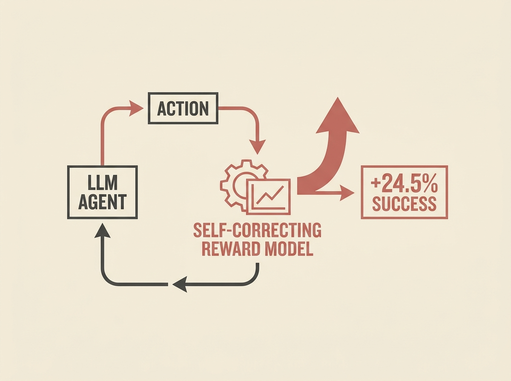

LLM agents frequently stumble with long-horizon planning, sparse rewards, and dynamic environments. This paper introduces a sophisticated `Reward-Driven LLM Agent Workflow` that directly tackles these challenges, offering a significant leap forward in autonomous decision-making.

The architecture synthesizes a `Partially Observable Markov Decision Process (POMDP)` routing mechanism with an internal, self-correcting reward model. This allows agents to evaluate decision trajectories *before* execution, dramatically reducing error accumulation and hallucination rates.

Empirical results are compelling: a 24.5% absolute improvement in task success rate over mainstream baselines like the `ReAct` framework on benchmarks like `ALFWorld` and `WebShop`. This research provides a practical, scalable reference for developing robust AI agents in complex, multi-step systems, complete with open-source code.
