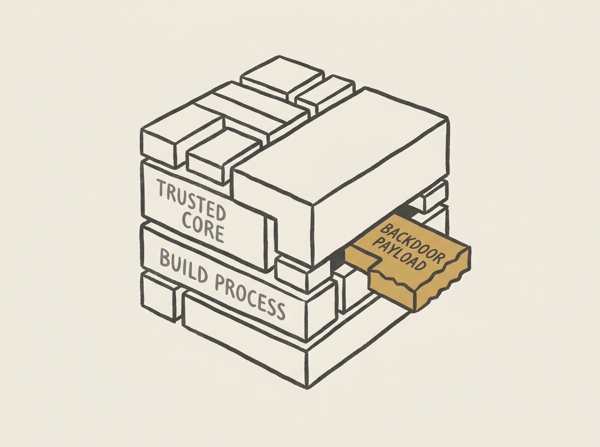

The XZ Utils backdoor was a wake-up call, and the book 'Half a Second' dives deep into its story. It reveals how a Microsoft engineer's observation of a mere half-second login delay led to the unraveling of a two-year-long, highly sophisticated supply chain attack. This was not found by an advanced security system, but by human curiosity. 

The incident starkly highlights the precarious state of much critical open-source software, often maintained by a handful of unpaid, overstretched volunteers. This vulnerability makes such projects prime targets for malicious actors seeking to embed backdoors into foundational infrastructure. 

For senior engineers, this is a must-read not just for the intriguing narrative, but for its profound lessons on supply chain security, code ownership, and the need for greater investment in the overlooked pillars of our digital world. The insight gained here will directly inform how you think about dependencies and risk management in your own systems.
