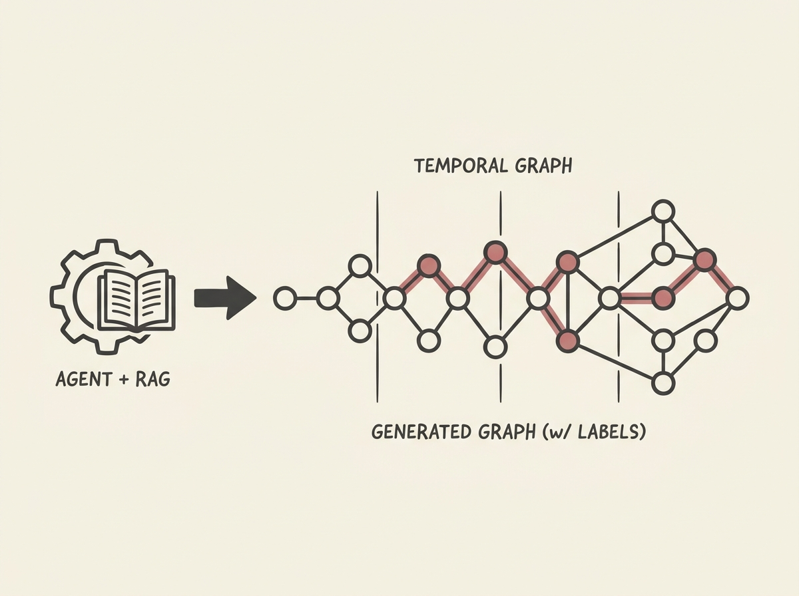

High-quality temporal graph benchmarks are critical for training Graph Neural Networks, yet they are scarce due to privacy and annotation challenges. `SAGA` offers an innovative solution: a Synthetic Agentic Graph Architecture that leverages LLM agents to generate these complex datasets.

`SAGA` uses a clever Skeleton-First, Semantics-Second approach. An O(1)-per-edge generator builds the structural backbone, and then LLM agents, guided by RAG-based rule bases, inject rich domain-specific semantics. This even yields ground-truth anomaly labels as a byproduct.

This system demonstrates impressive scalability, generating 500,000 temporal edges on a single H100 GPU in under 90 minutes. It is a powerful example of applied AI agents solving a real-world data problem, providing a blueprint for synthetic data generation in complex domains like finance or cybersecurity.
