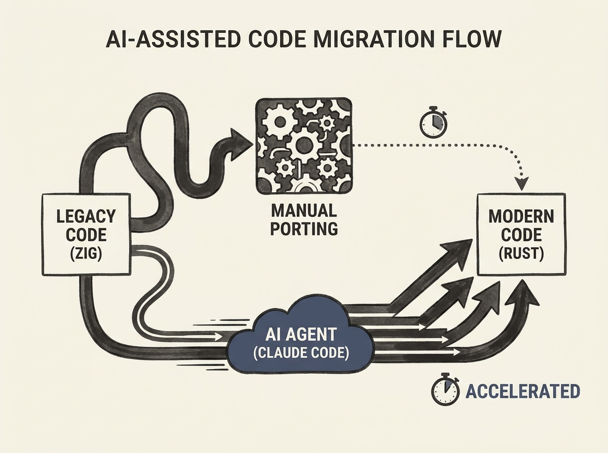

Anthropic just revealed how their AI agents, specifically Claude Code, are tackling massive code migrations. We are talking about porting a million-line codebase, like Bun's Zig-to-Rust migration, in less than two weeks. This is not a theoretical exercise; it is production-grade. 

What is truly eye-opening is the insight: they learned that you do not fix the code, you fix the process that produced the code. Their approach involved dynamic workflows and multiple phase gates, achieving a 100 percent pass rate on Bun's test suite before merge. 

This demonstrates a concrete, applied use case for AI agents that significantly impacts developer productivity and engineering practices. The era of AI-driven code transformation is here.
