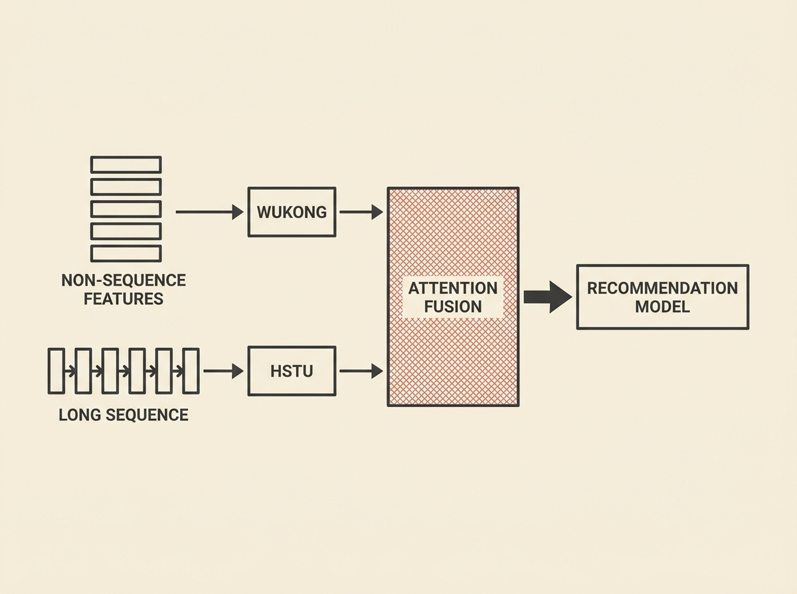

Building scalable recommendation systems often means juggling distinct architectures for non-sequence features and user behavior sequences. `WHALE` presents a compelling unified approach, integrating Wukong for high-order feature interactions and HSTU for long user histories.

This architecture uses an attention-based fusion to allow Wukong-derived representations to query HSTU-derived behavior representations, enabling rich, progressive information exchange throughout the network. It is not just theoretical; `WHALE` has been deployed in production systems.

The paper highlights practical model-systems co-design techniques, including customized Triton kernels, to boost training and inference efficiency. If you are building large-scale recommender systems, `WHALE` offers concrete insights into unifying complex feature modeling for real-world performance gains.
