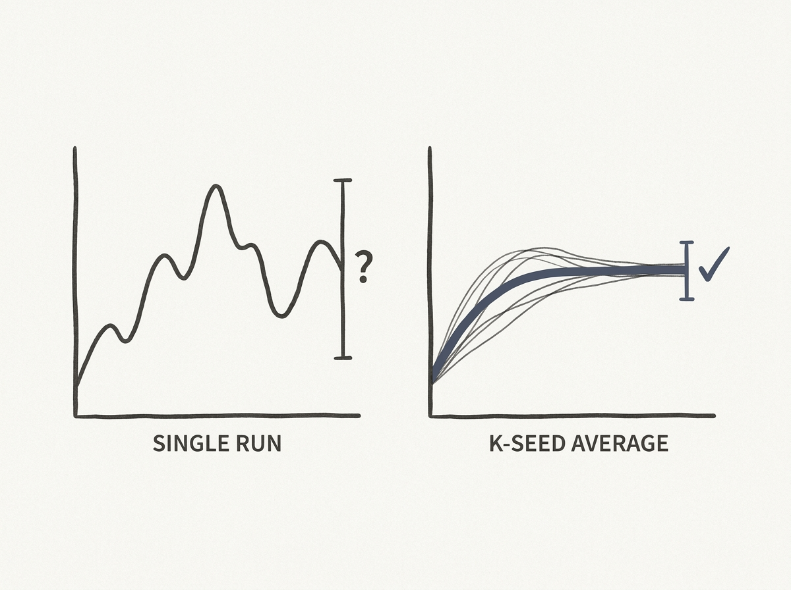

If you are building or evaluating AI agents, particularly for computer-use tasks, you need to read this. The common practice of reporting agent success rates from single runs is deeply misleading. This paper uncovers that variance, not just the agent's policy, often dominates reported performance.

The authors conducted a variance-components decomposition, finding that evaluation variance is negligible, but the data draw and run-to-run nondeterminism account for a significant, often dominant, share of performance variability. This means a single run can have a 30 percent chance of falling into a distinct failure mode, rendering mean-plus-standard-deviation an inadequate summary.

This work introduces `cua_reliability`, a library for routine k-seed reporting to provide robust metrics. It teaches a critical lesson: robust agent development requires understanding and mitigating this inherent variance. It challenges the field's current evaluation paradigms and offers a practical path forward for building truly reliable agents.
