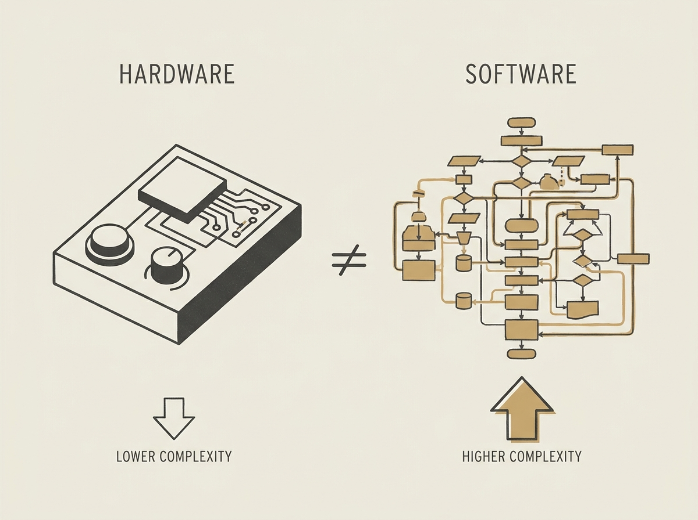

Many software engineers assume hardware development is intrinsically harder than software. This article offers a compelling counter-narrative from someone who successfully built and sold 2,500 MIDI recorders.

The author, after a career in software, expected hardware to be the toughest part. Instead, he found the 200,000 lines of software across firmware, app, and manufacturing tooling to be the real beast. The hardware, surprisingly, was smooth sailing.

This perspective challenges a common myth and provides valuable insight for engineers thinking about expanding their skill sets beyond pure software. It reveals that the difficulty often lies in the specific problem domain, not the medium.
