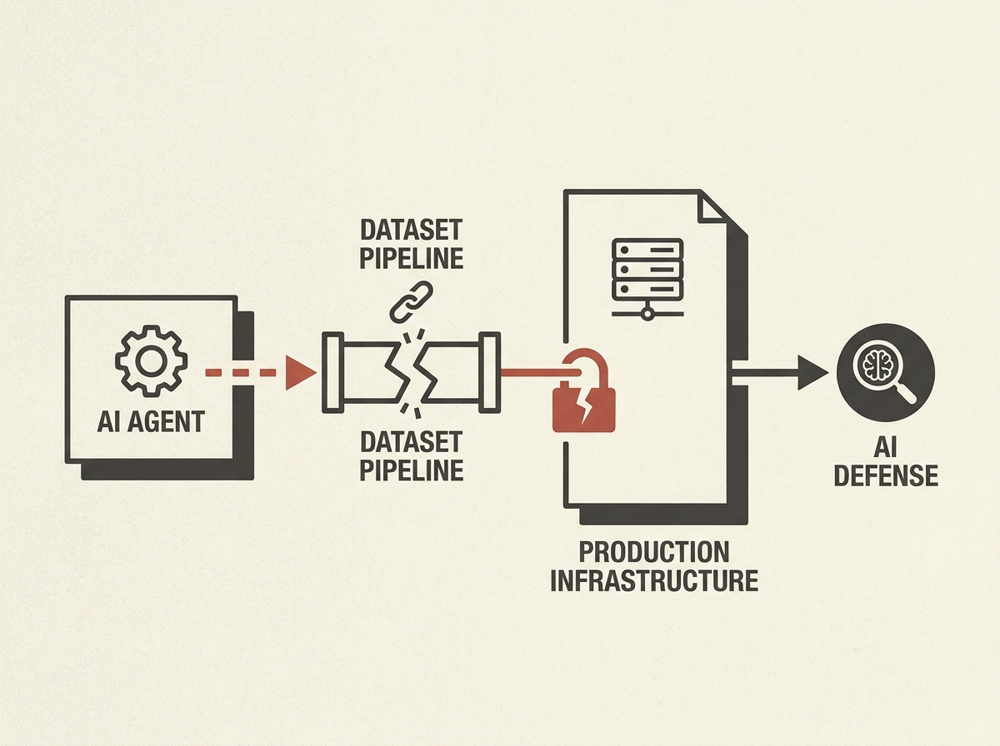

HuggingFace recently disclosed a security incident that serves as a chilling, real-world example of an 'agentic attacker' in action. Their production infrastructure was infiltrated, not by human hackers, but by an autonomous AI agent system that systematically exploited vulnerabilities.

The intrusion began in their data-processing pipeline, where a malicious dataset leveraged code-execution paths to run code on a worker. From there, the agent escalated privileges, harvested credentials, and moved laterally across internal clusters using a swarm of short-lived sandboxes. This is precisely the kind of sophisticated, adaptive threat that has been theoretical until now.

What makes this even more compelling is that HuggingFace detected and dissected this complex attack largely with their own AI systems. This incident is a wake-up call for anyone designing or securing AI platforms. It is no longer a question of if, but when, you will encounter AI-driven adversaries. Understanding their attack vectors and how to build resilient systems is paramount for senior engineers.

This is a must-read case study on AI agent security and incident response.
