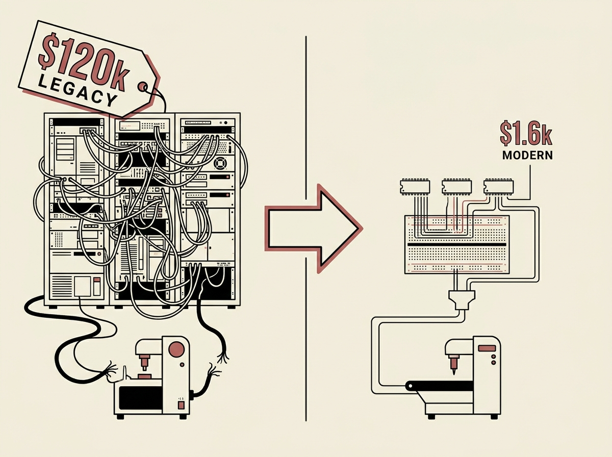

Replacing a $120,000 bowling alley system with just $1,600 worth of ESP32s is not just a cost-saving measure, it is a masterclass in practical system design and engineering ingenuity. This project showcases how modern, inexpensive microcontrollers can entirely disrupt legacy proprietary hardware.

The engineer built a custom solution handling everything from pinsetter control to scorekeeping, integrating custom PCBs and open-source software. This demonstrates that deep technical skill, not just budget, drives truly innovative solutions.

This is a perfect example of what can be achieved by applying fundamental engineering principles to real-world problems.
