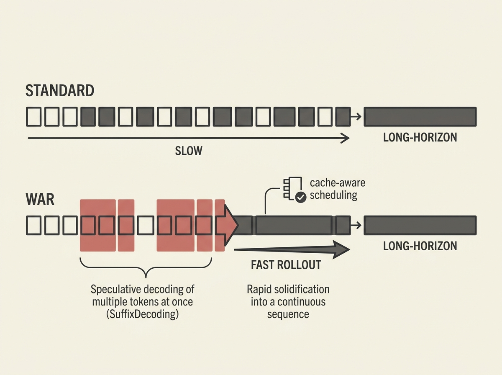

Long-horizon rollouts are becoming the biggest bottleneck in agentic reinforcement learning, with trajectories stretching to tens of thousands of tokens. WAR, a new workload-aware rollout system, offers a breakthrough.

It tackles this by jointly optimizing decoding and scheduling. Under low load, WAR uses SuffixDecoding for model-free speculative decoding, reusing past suffixes to draft future rollouts without needing a separate draft model and avoiding GPU contention. This alone provides a 1.4x throughput improvement.

Under high load, when speculative decoding hits limits, WAR shifts to cache-aware scheduling. A global scheduler intelligently places requests based on cache locality and trajectory progress, cutting redundant KV-cache recomputation and load imbalance for up to 1.6x speedup. This is a game-changer for scalable agent training.
