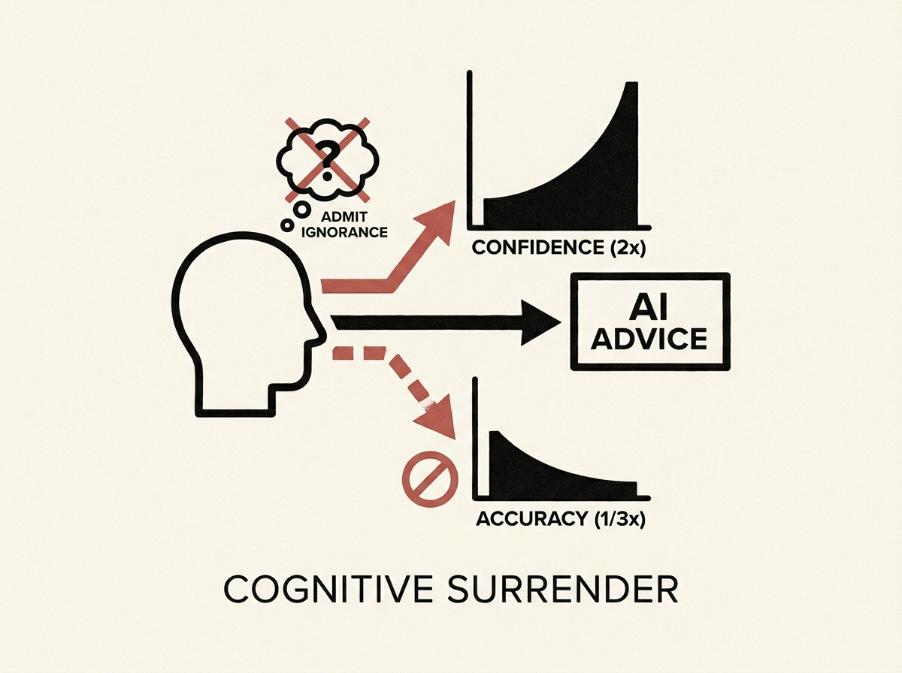

A recent study reveals a critical downside to human-AI interaction: receiving AI advice can make people three times less accurate while simultaneously doubling their confidence. This phenomenon, termed "cognitive surrender," shows how AI can suppress critical thinking.

The research deliberately used questions where AI models struggled, demonstrating that the mere availability of AI diminished users' willingness to admit when they did not know an answer. Accuracy plummeted from 27% to 9%, while confidence surged from 30% to 76%.

This has profound implications for designing AI agents and systems. It suggests we must build AI interfaces that encourage critical engagement, rather than passive acceptance, to avoid eroding human judgment in critical workflows.
