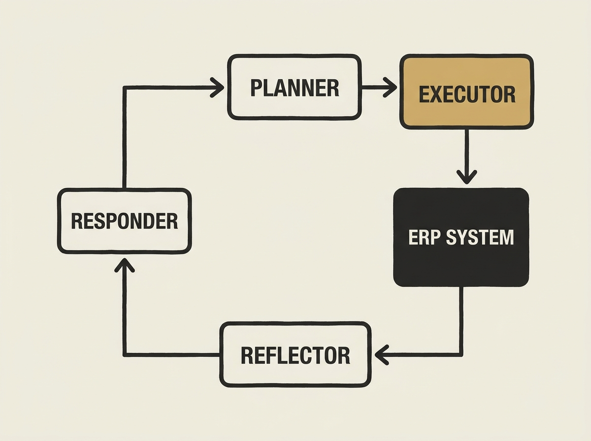

Traditional ERP systems record transactions but leave operational decisions to humans. Now, a new multi-agent LLM architecture called Agentic ERP is changing that, enabling autonomous execution of end-to-end business workflows.

This architecture combines role-aligned LLM agents with a risk-tiered human-in-the-loop harness and a graph-based orchestrator. It is not just theoretical; it functions on a production ERP backend. The core idea is decomposing complex problems for agents and using a Planner-Executor-Reflector-Responder loop for robust execution.

The results are compelling: a 365-day simulation showed the multi-agent system sustained operations with zero stockouts, while rule-based baselines accumulated hundreds. This offers a blueprint for senior engineers aiming to move enterprise systems from passive recording to active, intelligent decision-making.
