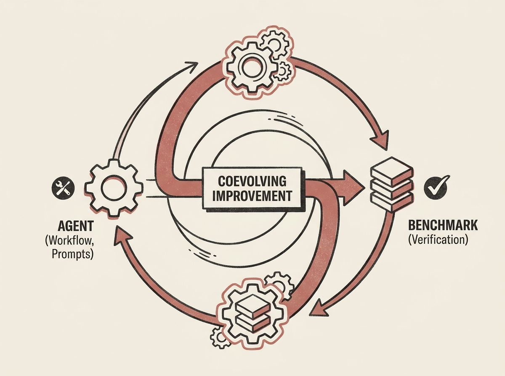

The idea of self-modifying agents sounds like science fiction, but a new paper shows how to build them for formal mathematical reasoning with Lean. This goes beyond simple prompt engineering.

The system features a self-evolving Lean proof agent where the proof workflow, prompts, and tools are fully mutable within a trusted runtime. What is even more fascinating is that the agent and its benchmark coevolve. As the agent improves, the benchmark updates with harder proof obligations, ensuring continuous learning.

Crucially, all evolution is strictly Lean-grounded. A success counts only if it yields a Lean-verified proof. This verifiable self-evolution pushed solve rates on a held-out test set from a 12.7% baseline to 45.1%, showcasing a powerful paradigm for building truly adaptive and robust AI agents.
