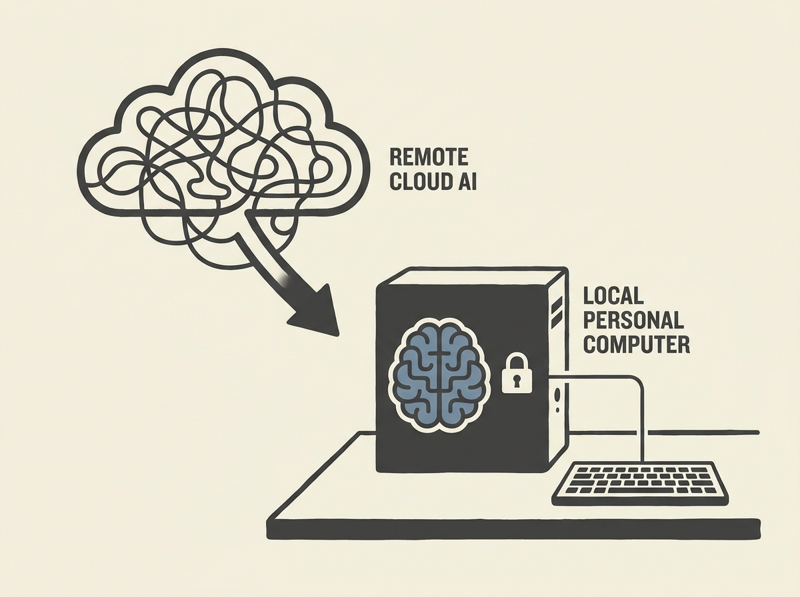

Ollama is making waves by bringing the "personal computer moment" to AI, empowering developers to run open models on their own machines with unprecedented ease. This is a game-changer for applied AI and LLM infrastructure.

The founders, who previously built Docker Desktop, share a vision where AI is yours to build, run, and customize. They emphasize ownership, privacy, and avoiding vendor lock-in, which resonates deeply with the engineering community.

Imagine getting the latest open models up and running with a single command, then building on them via a simple API. This approach radically lowers the barrier to entry, fostering experimentation and innovation in local AI development. It is like Docker for LLMs, truly unlocking the power of open models for millions of developers.

This platform represents a significant step towards democratizing access to powerful AI tools.
