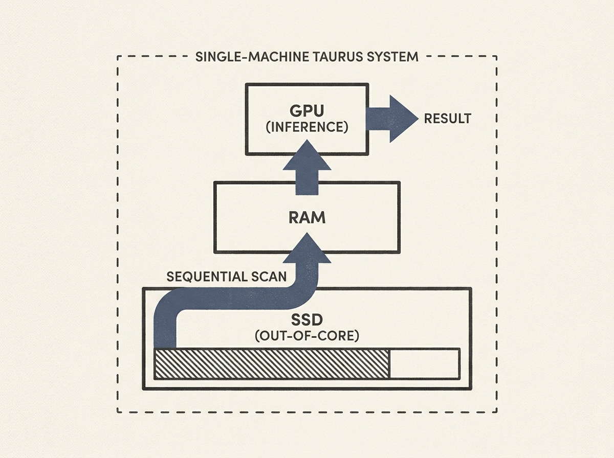

Performing Graph Neural Network (GNN) inference on billion-scale graphs that do not fit into RAM has been a nightmare due to massive I/O costs. Taurus offers a groundbreaking solution.

This single-machine system re-engineers layer-wise GNN inference as source-centric broadcasts over sequential SSD scans, backed by a tightly pipelined GPU-CPU-SSD hierarchy. It also includes topology-aware reordering and pending-message eviction to prevent wasted reads and page-cache pollution.

The performance gains are staggering: Taurus outperforms state-of-the-art baselines like DGI by 7-25x and vertex-wise baselines by 40-140x on graphs with up to 4 billion edges and 514 GiB of features. This is a masterclass in out-of-core system design for large-scale AI.
