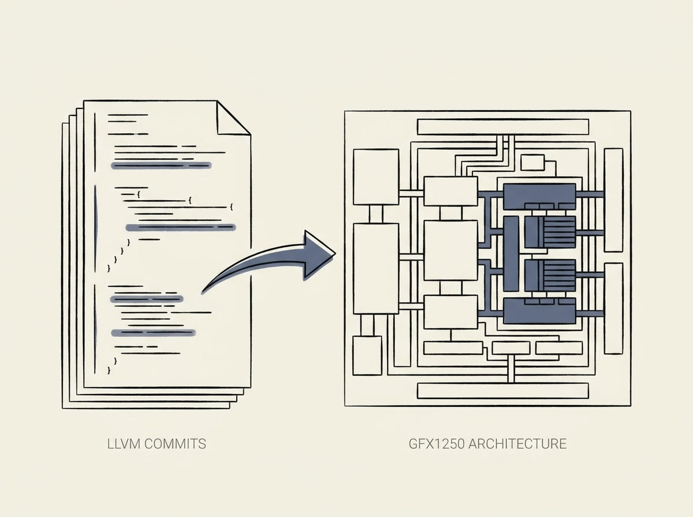

Get a sneak peek into the future of AI hardware with a deep dive into AMD's upcoming MI400 series accelerators (GFX1250/MI455X), uncovered through LLVM compiler commits. This is not marketing fluff; it is real architectural insight.

The analysis reveals significant shifts like a shared vector L0 cache across the entire Workgroup Processor (WGP) and a focus on Wave32 mode. These details hint at how AMD is optimizing its hardware for modern machine learning workloads, potentially impacting performance and programming models for LLM inference and training.

Understanding these low-level architectural decisions, even before official announcements, provides a crucial advantage for anticipating future LLM infrastructure capabilities and bottlenecks.
