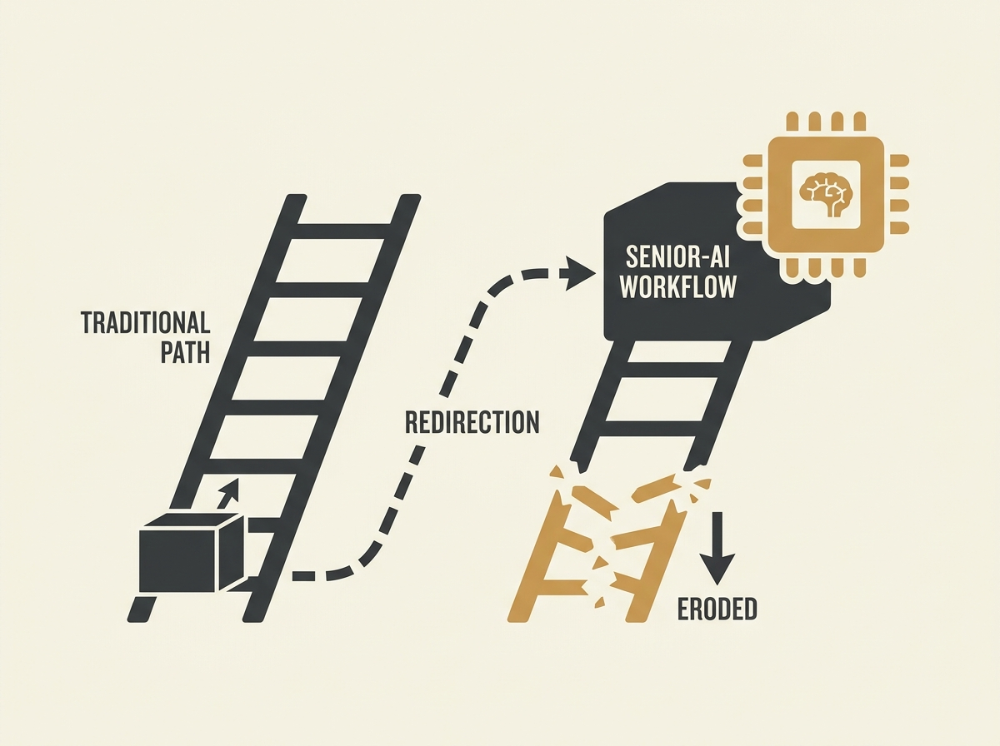

Generative AI is not just changing how we work, it is eroding the very pathway through which junior engineers develop into seniors.

A study based on interviews with both junior and senior engineers reveals a pattern of "Absorption": GenAI is redirecting entry-level work into senior-AI workflows. This means juniors are losing the 
