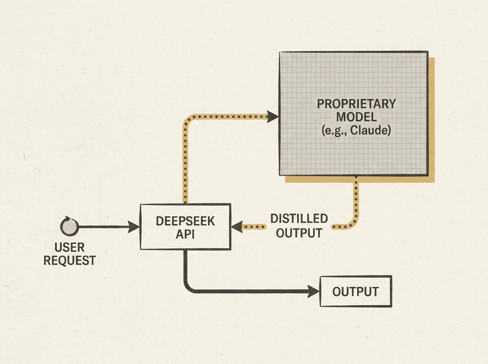

DeepSeek appears to be engaging in a large-scale operation to collect outputs from proprietary models like Claude Fable 5, then using those outputs for distillation, according to a recent investigation.

The investigation found that DeepSeek's 'V4' model produced virtually identical outputs to Fable 5 for complex prompts, exhibiting a different Chain-of-Thought (CoT) structure than expected from DeepSeek's own models. Moreover, quality significantly dropped when prompts touched on topics Fable's classifiers would typically flag, strongly suggesting a routing mechanism.

This is not just about ethics; it offers a rare glimpse into the complex (and sometimes hidden) infrastructure behind AI services. Engineers need to be aware of how the models they integrate might actually be operating under the hood, impacting performance, cost, and trust. It is a stark reminder that what you configure might not always be what you get, and challenges us to think about the veracity of AI model claims.

This is a critical insight for anyone building with or depending on third-party LLMs.
