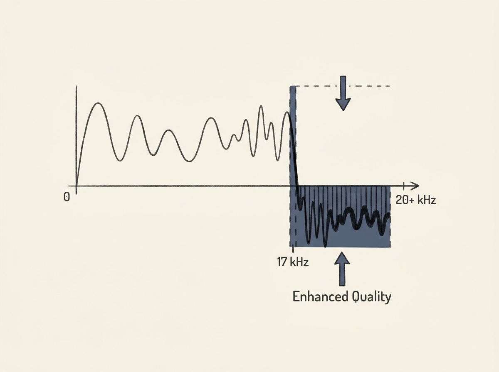

SoundCloud made a counter-intuitive engineering choice that dramatically improved their audio quality, and it is a fascinating lesson in system optimization. They deliberately low-pass their AAC transcoded audio at 17 kHz, essentially removing the highest frequencies.

Why cut off part of the sound? Human hearing is not uniform; we are most sensitive to frequencies between 2 and 5 kHz. By sacrificing the barely audible high end, SoundCloud's encoder can allocate more bits to the critical lower and mid-range frequencies.

This trade-off means a more faithful, clearer reproduction where it matters most, despite a smaller overall frequency range. It is a brilliant example of optimizing for human perception rather than raw data, offering a real-world insight into applied engineering and system design under constraints.
