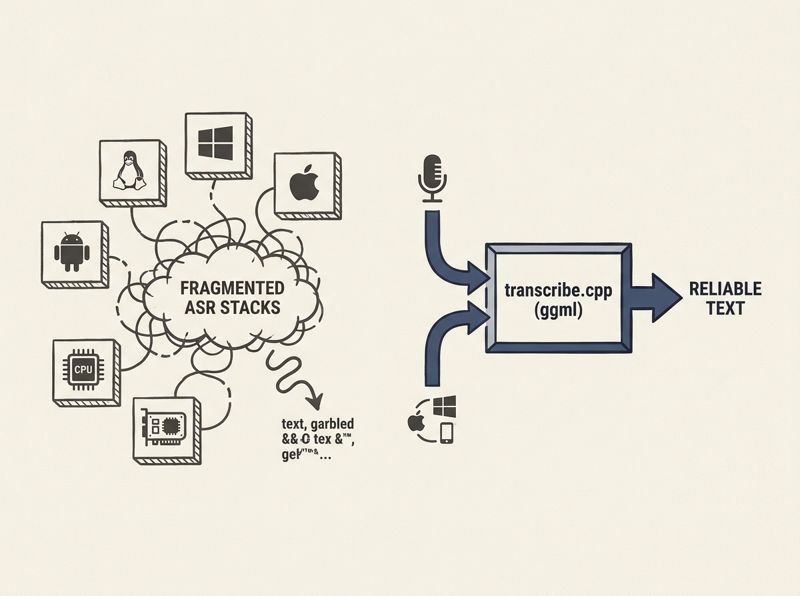

Deploying cross-platform speech-to-text applications with existing ASR inference stacks is often a painful exercise, struggling with performance and distribution. Transcribe.cpp aims to solve this by offering a ggml-based C++ library built for efficiency.

The library emphasizes numerical validation, WER testing, and broad GPU acceleration across platforms (Mac, Windows, Linux). It addresses the practical challenge of embedding performant AI models without the overhead of larger frameworks like PyTorch.

This offers a genuinely useful tool for engineers building applications that require robust, efficient, and cross-platform speech-to-text capabilities.
