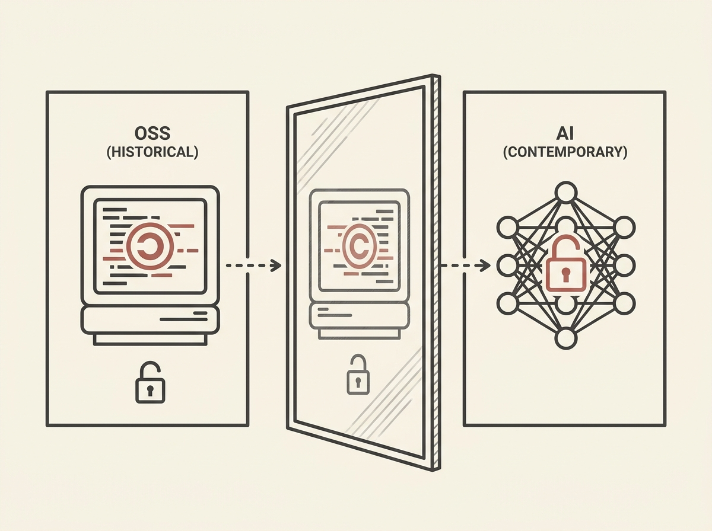

The open versus closed debate is not new; it is merely being replayed with AI, echoing past battles over open-source software. Richard Stallman championed absolute software freedom in the 80s, facing arguments about commercial viability and control.

Today, we see a similar dichotomy: proprietary AI models versus open-source alternatives. This is more than just a technical choice; it is a fundamental philosophical debate with profound implications for innovation, accessibility, and the power structures of the tech industry.

Understanding these historical parallels provides crucial context. It helps predict how the AI ecosystem might evolve and allows engineers to navigate the strategic landscape more effectively, informing decisions about which platforms to build upon and contribute to.

The lessons from the past provide a roadmap for the future of AI.
