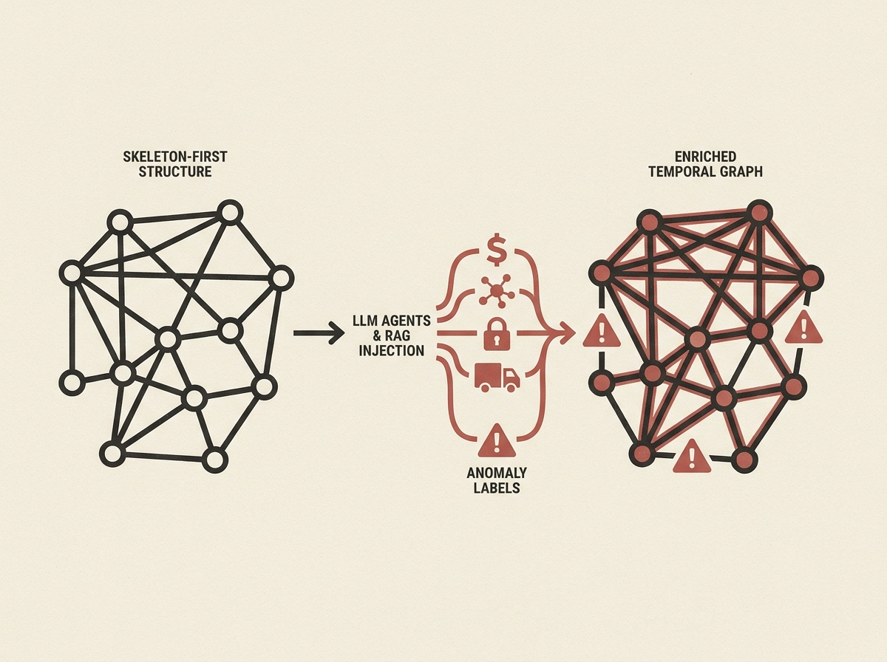

Generating realistic temporal graph benchmarks for training graph neural networks is hard, often blocked by privacy or annotation costs. SAGA introduces a compelling solution: using LLM agents with RAG to synthesize large-scale, semantically rich temporal graphs, complete with ground-truth anomaly labels.

Its "Skeleton-First, Semantics-Second" architecture elegantly decouples structural generation from semantic injection, allowing LLM agents to infuse domain-specific knowledge across finance, network, cyber, and transportation scenarios. This approach tackles a crucial data scarcity problem head-on.

SAGA generates 500,000 edges with controlled anomalies in under 90 minutes on a single H100 GPU, demonstrating serious scalability and efficiency. This is a game-changer for anyone needing high-quality synthetic data for robust model training.