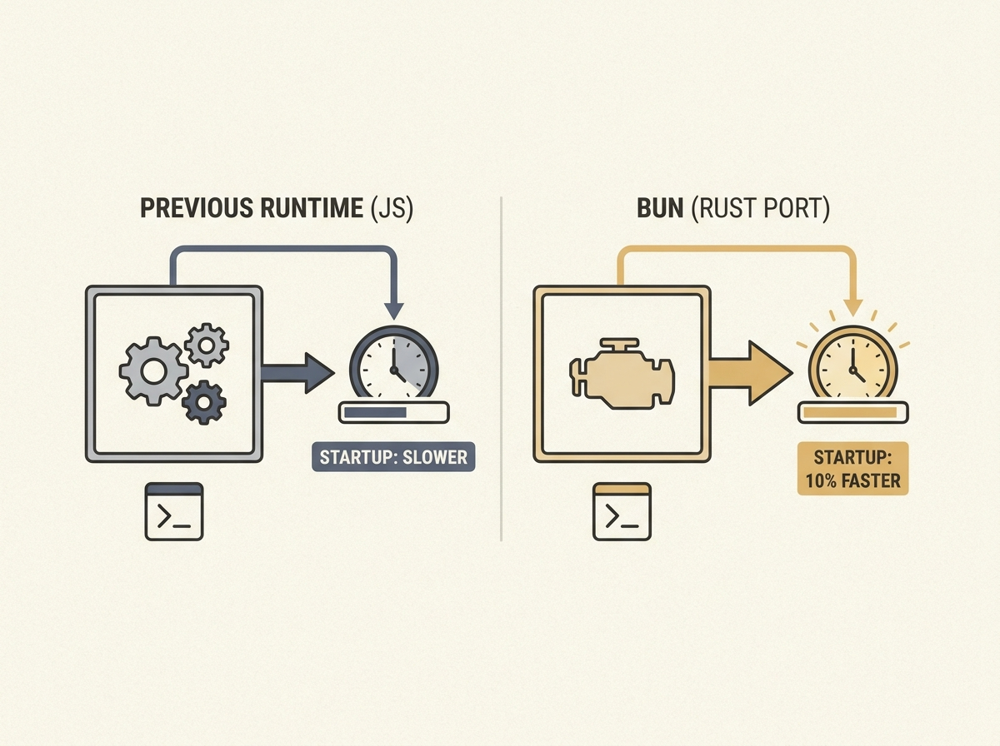

---
authors:
- Simon Willison
comments: https://news.ycombinator.com/item?id=48966569
date: '2026-07-19'
hn_id: '48966569'
image: 16-hn-48966569-infographic.png
interest_score: 7
section: engineering
source: hn
tags:
- bun
- catchup
- claude-code
- hn
- rust
- version-verification
title: Evidence confirms Claude Code uses Bun ported to Rust
url: https://simonwillison.net/2026/Jul/19/claude-code-in-bun-in-rust/
why_read: This post provides compelling technical evidence that Claude Code has indeed
  adopted a Rust-ported version of Bun, despite the change going largely unnoticed.
  Readers will learn how to verify this for themselves using command-line tools.
---

Claude Code, a tool used by millions, silently switched its underlying JavaScript runtime to Bun's Rust port. The result? A 10% faster startup time on Linux, a quiet victory for performance engineering.

This move highlights a growing trend: even established systems are seeking significant performance gains by re-implementing core components in Rust. It also shows that not all impactful changes need to be loudly announced to deliver real user benefits.

It is a compelling reminder that foundational architectural decisions, like language choice for critical components, directly translate to tangible improvements for users.