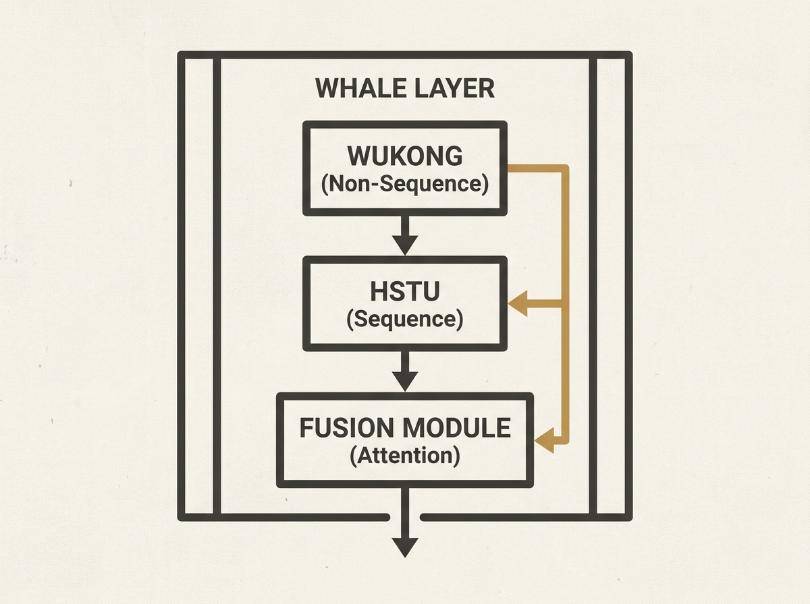

Recommendation system scalability often forces a choice between modeling non-sequence features (user, item, context) or long user-behavior sequences. WHALE introduces a unified architecture that cleverly combines the strengths of Wukong and HSTU backbones.

Each WHALE layer integrates a Wukong module for high-order feature interactions, an HSTU module for sequence modeling, and an attention-based fusion module. This allows Wukong-derived representations to query HSTU-derived behaviors, enabling fine-grained evidence retrieval from long histories.

Critically, WHALE emphasizes industrial deployment with customized Triton kernels and model-systems co-design, yielding consistent offline gains and positive online gains with modest throughput trade-offs. This is a practical blueprint for modern, scalable recommenders.