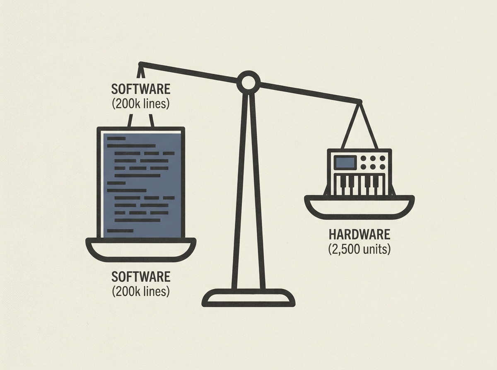

---
authors:
- Chip Weinberger
comments: https://news.ycombinator.com/item?id=48966713
date: '2026-07-19'
hn_id: '48966713'
image: 17-hn-48966713-infographic.png
interest_score: 7
section: career
source: hn
tags:
- catchup
- hardware-development
- hn
- perceived-difficulty
- product-development
- software-development
title: Hardware's reputation for being difficult is overstated
url: https://chipweinberger.com/articles/20260719-hardware-is-not-so-hard
why_read: This post challenges the common perception that hardware development is
  inherently hard, offering a real-world account of a successful product launch where
  software proved to be the greater challenge. Readers will gain a nuanced understanding
  of the true difficulties in bringing a tech product to market.
---

For many software engineers, the world of hardware development feels daunting and complex. But one engineer, after successfully building and selling 2,500 MIDI recorders, found a surprising truth: hardware was "not so hard."

His experience reveals that the most challenging part of the entire project was the 200,000 lines of firmware, app, and manufacturing tooling software. This flips the common narrative, suggesting that the well-understood complexities of software often outweigh the perceived difficulties of electronics and manufacturing.

This insight is a valuable lesson for any engineer contemplating a venture into a new technical domain, reminding us to critically assess where the true challenges often lie.