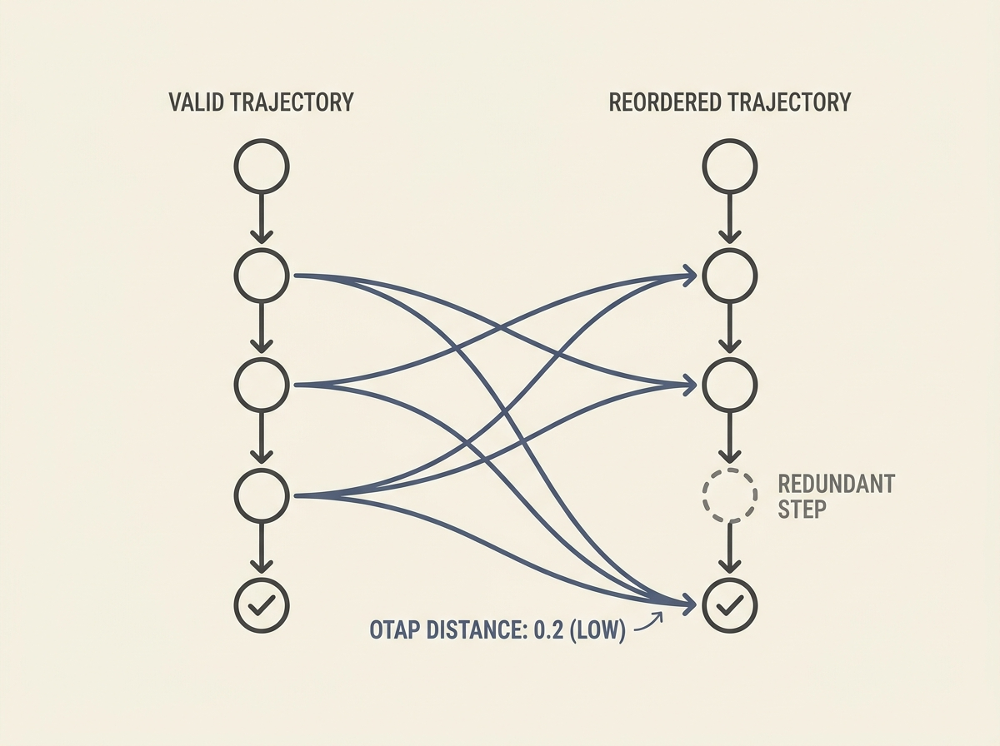

Evaluating large language model agents often falls short, relying on simple success flags or exact matches that do not truly capture the quality of an agent's planning and execution. A new approach, Otap, reframes this challenge, viewing agent trajectory evaluation as a distance problem between execution graphs.

Otap uses an unbalanced fused Gromov-Wasserstein transport problem over attributed dependency graphs. This novel pseudo-metric is invariant to dependency-preserving reorderings and robust to redundant steps, making it much more nuanced than traditional metrics. It accurately distinguishes valid from invalid trajectories even when semantics-only metrics fail.

For senior engineers building or deploying LLM agents, understanding how to genuinely measure an agent's performance is critical. Otap offers a path to more rigorous evaluation, helping diagnose why agents succeed or fail and paving the way for more robust agent development.