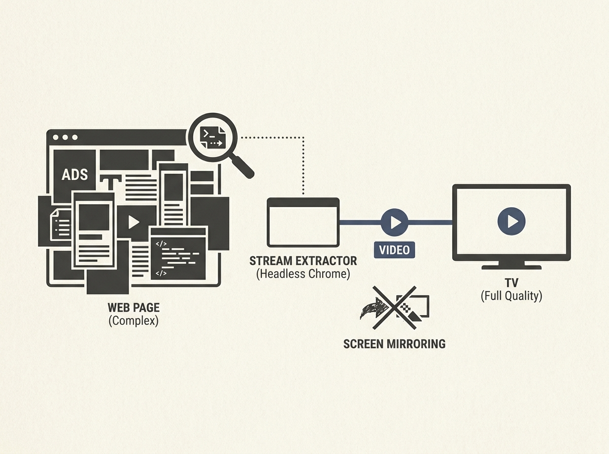

---
authors:
- xonery
comments: https://news.ycombinator.com/item?id=48964015
date: '2026-07-19'
hn_id: '48964015'
image: 20-hn-48964015-infographic.png
interest_score: 7
section: engineering
source: hn
tags:
- castor
- catchup
- chrome-devtools-protocol
- hn
- smart-tv
- subtitles
- transcoding
- web-video-casting
title: Castor casts real web video streams to TVs in full quality
url: https://github.com/stupside/castor
why_read: This text introduces Castor, a tool designed to cast full-quality, real-time
  web video streams directly to your TV. Readers will understand how it overcomes
  common issues with screen mirroring and arbitrary web video casting.
---

Streaming arbitrary web video to a TV often involves clunky screen mirroring or limited native support. The open-source Castor project offers an ingenious solution by leveraging headless Chrome and the DevTools Protocol to extract, transcode, and cast real video streams.

This project demonstrates a smart way to bypass content restrictions and optimize streaming quality. By programmatically interacting with web pages and monitoring network traffic, Castor can identify the actual video stream, allowing for full-quality casting and even on-the-fly subtitle burning.

It is a fantastic example of using existing tools in a creative, powerful way to build a robust media streaming utility.