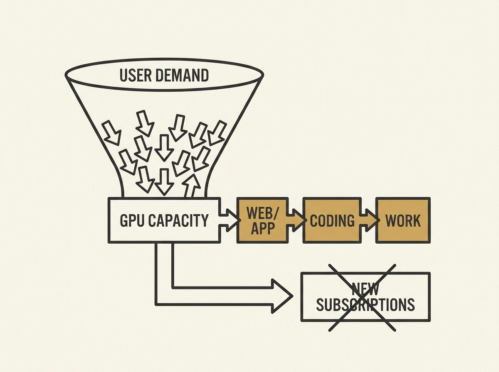

---
authors:
- Kimi.ai
comments: https://news.ycombinator.com/item?id=48969291
date: '2026-07-19'
hn_id: '48969291'
image: 21-hn-48969291-infographic.png
interest_score: 7
section: ai
source: hn
tags:
- catchup
- compute-capacity
- demand-management
- hn
- kimi-k3
- membership-plans
- subscription-pausing
title: Kimi K3 Pauses New Subscriptions Due to High Demand
url: https://twitter.com/kimi_moonshot/status/2078855608565207130
why_read: This announcement informs users about Kimi K3's temporary pause on new subscriptions
  due to overwhelming demand. It outlines future plans to split membership tiers to
  better manage compute resources and improve user experience.
---

The compute crunch for AI models is very real. Moonshot AI has had to temporarily suspend new subscriptions for its Kimi K3 model because demand outstripped their current GPU capacity.

This is not just a marketing stunt; it is a clear signal about the intense infrastructure demands and scaling challenges involved in running large language models in production. Companies are literally running out of GPUs to serve user requests.

Their solution includes pausing new users and splitting memberships into focused plans (web/app/work vs. coding workflows) to better manage compute allocation. It is a pragmatic approach to ensure service quality for existing users while scrambling to add more capacity.

This situation underscores the critical role of efficient LLM infrastructure and resource management in applied AI, offering a candid look at the challenges faced by even major players in the field. The scaling problem is far from solved.