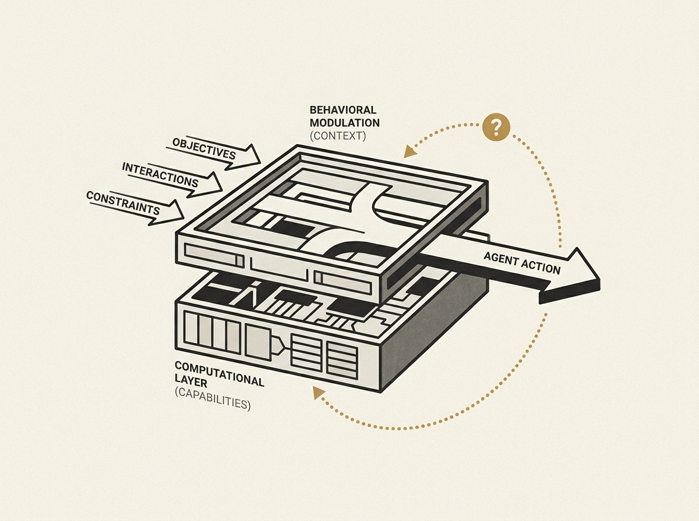

As AI agents increasingly integrate into complex real-world systems, understanding *why* they behave a certain way becomes paramount. This perspective paper introduces 'layer attribution,' a powerful diagnostic framework for AI agent behavior that helps engineers and researchers dissect an agent's actions.

The framework distinguishes between the foundational computational layer, which dictates an agent's inherent capabilities (architecture, memory, perception), and the behavioral modulation layer, which shapes how those capabilities are expressed through external factors like objectives, social interactions, and institutional constraints. This distinction is critical for effective system design and troubleshooting.

For senior engineers, this framework offers a mental model to pinpoint the source of emergent behaviors. Is it a limitation in the underlying model, or an issue with the agent's environmental context or incentive structure? This clarity is essential for designing robust, predictable, and governable AI agent systems.