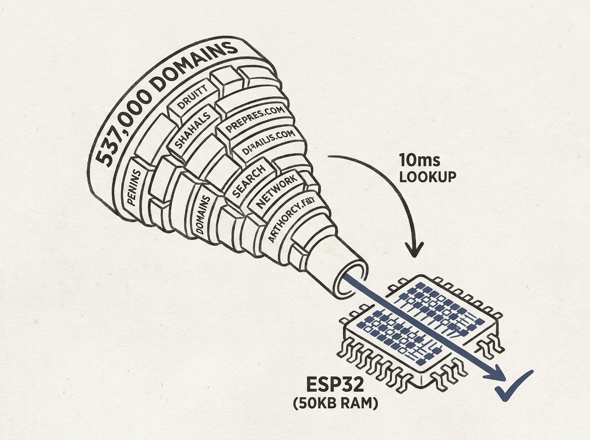

---
authors:
- sbulaev
comments: https://news.ycombinator.com/item?id=48968348
date: '2026-07-19'
hn_id: '48968348'
image: 22-hn-48968348-infographic.png
interest_score: 7
section: engineering
source: hn
tags:
- ad-blocking
- catchup
- esp32
- firmware-optimization
- hn
- low-memory-computing
title: Clever hacker fits 537,000 domains in tiny ESP32 ad-blocking dongle
url: https://www.tomshardware.com/networking/clever-hacker-fits-537-000-domains-in-a-tiny-usd5-esp32-ad-blocking-dongle-firmware-uses-only-around-50kb-of-ram-and-can-answer-blocked-lookups-in-10-milliseconds
why_read: 'This describes an impressive engineering feat: an ad-blocking dongle on
  a $5 ESP32 that handles over half a million domains with minimal RAM. You will learn
  about the capabilities of constrained hardware and clever optimization techniques.'
---

Imagine fitting half a million domains into a $5 device, performing ad-blocking lookups in just 10 milliseconds, all while consuming a mere 50KB of RAM. This is not a fantasy; it is what one clever hacker achieved with an ESP32.

This project is a masterclass in extreme optimization and efficient engineering. It demonstrates how intelligent data structures and algorithms can overcome severe hardware constraints, a valuable lesson for any system designer or embedded engineer.

For those building scalable systems or working with limited resources, the techniques employed here - like highly optimized hash tables or compression - offer actionable insights. It makes you reconsider what is truly possible with minimal hardware.

Resourcefulness and efficiency remain paramount.