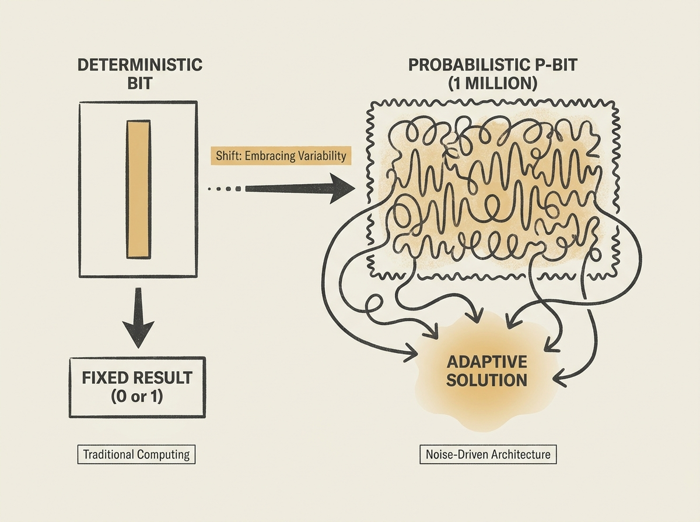

---
authors:
- rbanffy
comments: https://news.ycombinator.com/item?id=48971938
date: '2026-07-19'
hn_id: '48971938'
image: 23-hn-48971938-infographic.png
interest_score: 7
section: ai
source: hn
tags:
- catchup
- hn
- noise-processing
- p-bits
- probabilistic-computing
title: Biggest Probabilistic Computer Turns Noise Into Answers
url: https://spectrum.ieee.org/biggest-probabilistic-computer
why_read: This article details a significant advancement in probabilistic computing,
  revealing how the largest such computer, with 1 million p-bits, can convert noise
  into meaningful answers. Readers will understand the scale and unique problem-solving
  approach of this innovative technology.
---

The world's largest probabilistic computer just hit 1 million p-bits, demonstrating a radical shift in how we might tackle some of computing's toughest challenges. Instead of fighting noise, this architecture embraces it to find solutions.

This approach moves beyond the deterministic bits of traditional computing, leveraging probability and inherent randomness. Imagine solving complex optimization problems or designing new AI hardware where inherent variability is a feature, not a bug.

This development could open doors to entirely new classes of algorithms and systems, fundamentally altering our approach to certain computational tasks in the applied AI landscape.