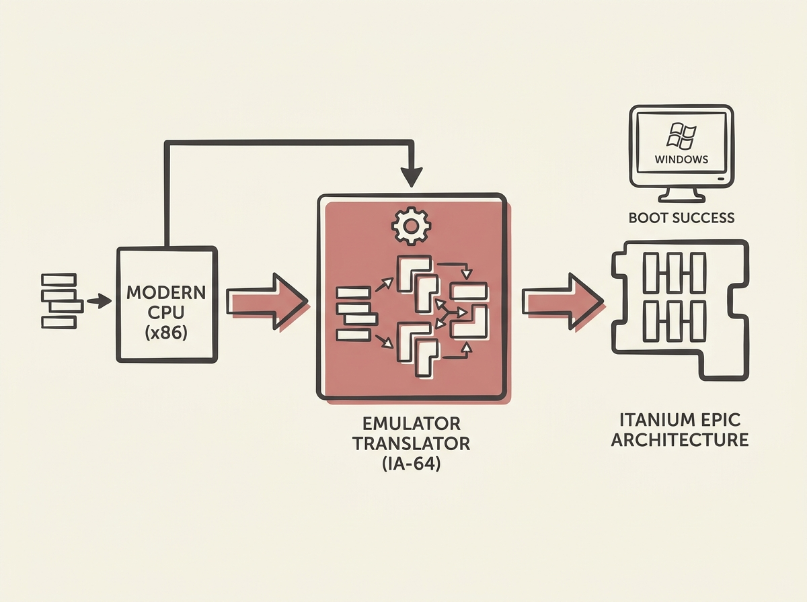

---
authors:
- Remy van Elst
comments: https://news.ycombinator.com/item?id=48971566
date: '2026-07-19'
hn_id: '48971566'
image: 24-hn-48971566-infographic.png
interest_score: 7
section: systems
source: hn
tags:
- catchup
- cpu-emulation
- emulator
- hn
- ia-64
- itanium
- windows-boot
title: An Intel Itanium emulator successfully boots Windows operating systems
url: https://raymii.org/s/blog/Intel_Itanium_IA-64-Emulator_that_boots_Windows.html
why_read: This article details a significant breakthrough in CPU emulation, showcasing
  an Intel Itanium (IA-64) emulator that successfully boots Windows Server 2003 and
  Windows XP 64-bit. Readers will learn about the current progress in emulating non-x86
  architectures and the challenges involved.
---

A new emulator can now boot Windows on an Intel Itanium (IA-64) machine, a remarkable feat of systems engineering given the architecture's complexity and historical obscurity. This is not just a throwback; it is a deep dive into emulation mechanics.

Successfully emulating a highly complex, non-x86 architecture like Itanium with its unique EPIC (Explicitly Parallel Instruction Computing) design reveals significant challenges in instruction set translation, memory management, and peripheral emulation. It offers a rare look at how historical hardware interacts with operating systems at a low level.

Understanding such emulation efforts can deepen your appreciation for modern CPU design, hypervisors, and the intricate dance between hardware and software, even if Itanium itself did not achieve widespread success.