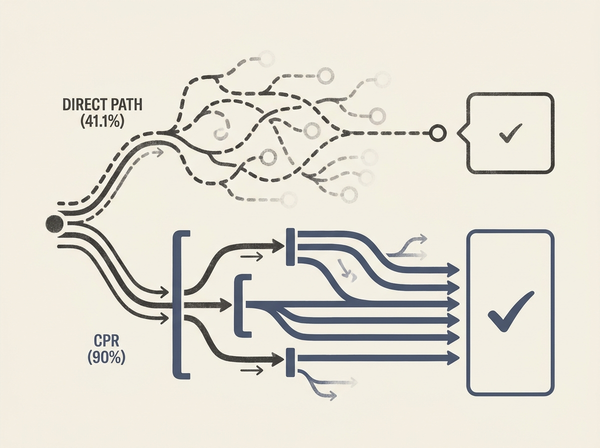

Are your multi-step LLM reasoning pipelines truly efficient, or are intermediate stages just adding cost without value? Constrained Path Reasoning (CPR) offers a formal way to measure when these committed stages earn their keep.

CPR introduces source-aware path hypotheses paired with granular stage-level accounting. It leverages trusted invariants to constrain the search space, focusing on metrics like effective branching, endpoint concentration, and, crucially, "cost per usable output."

The empirical findings are telling. In one experiment, residual triage recovered 63% of additional feasible yield with only 17.7% of the attempts, demonstrating the power of smart constraint application. For fixed-LLM accounting, the usable yield jumped from 41.1% direct to 90% after formalization and deterministic execution.

This framework is invaluable for engineers building complex AI agents, providing a structured approach to optimize reasoning pipelines for both performance and resource efficiency.