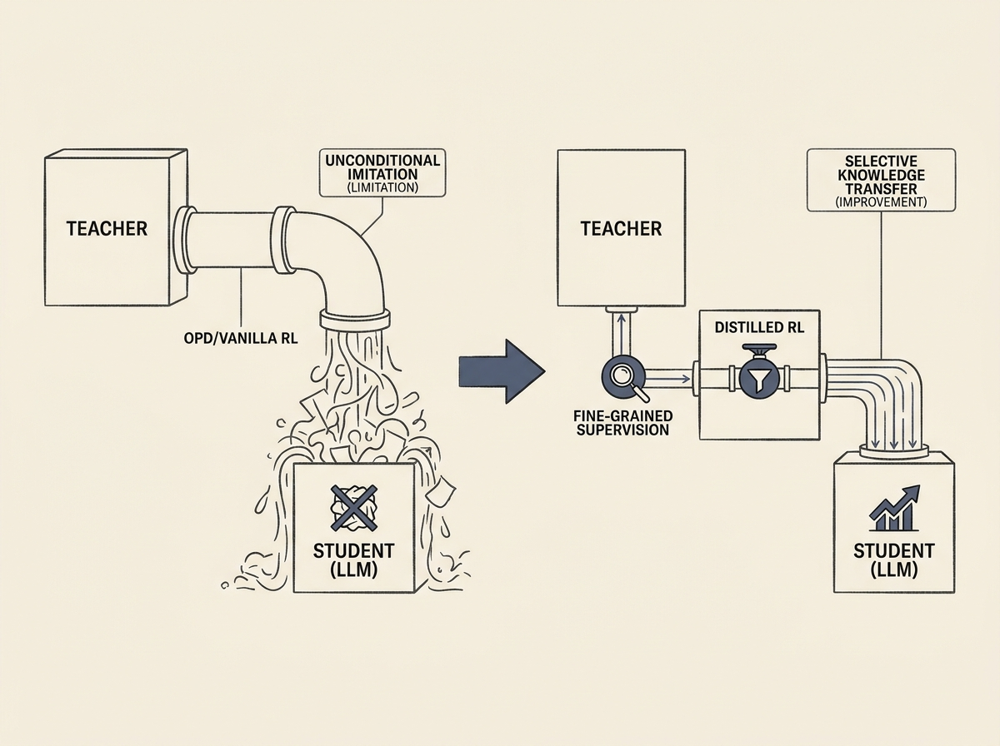

Improving large language models after their initial training is crucial, but current methods like vanilla Reinforcement Learning (RL) and On-Policy Distillation (OPD) have significant limitations.

Vanilla RL struggles with assigning credit for successful outcomes, while OPD often fails to transfer new, valuable knowledge without resorting to similar, less useful teachers. This paper introduces Distilled RL, a clever approach that integrates fine-grained teacher supervision directly into the RL objective.

This method allows for selective knowledge transfer, avoiding the pitfalls of unconditional imitation. It utilizes reverse importance sampling, negative sample resets, and sequence-level geometric normalization to achieve substantial performance gains in LLM post-training. This is a practical step forward for anyone working with LLM adaptation.