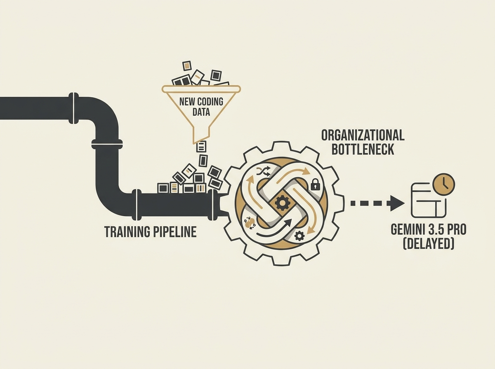

---
authors:
- Julia Love
- Davey Alba
comments: https://news.ycombinator.com/item?id=48965012
date: '2026-07-19'
hn_id: '48965012'
image: 26-hn-48965012-infographic.png
interest_score: 7
section: ai
source: hn
tags:
- ai-model-development
- catchup
- coding-stumbles
- google-gemini
- hn
- market-competition
- team-dynamics
title: Google's Gemini 3.5 Pro AI model faces delays from internal struggles
url: https://www.latimes.com/business/story/2026-07-17/inside-googles-gemini-delay-coding-stumbles-clashing-teams-frustrated-engineers
why_read: This article reveals the internal challenges at Google, including coding
  stumbles and team conflicts, that are delaying the release of its powerful Gemini
  3.5 Pro AI model. Readers will understand the complexities and market pressures
  affecting large-scale AI development.
---

Google is reportedly facing significant delays with Gemini 3.5 Pro, and the reasons highlight real-world struggles in large-scale AI development. Apparently, coding capabilities are a major hurdle, with internal teams clashing and engineers expressing frustration.

This is not just about a technical snag; it is a window into the organizational complexities of building foundational AI models. The article points to multiple layers of stakeholders and a vast product portfolio that complicates release cycles, echoing challenges many senior engineers face when integrating new tech across established systems.

Interestingly, Google reportedly updated training data for coding skills, but the results were disappointing. This suggests that simply feeding more data is not always the solution, and model capabilities can be harder to improve than anticipated.

These are the unseen realities of the AI race, showing that even industry giants grapple with fundamental issues in applied AI and engineering execution.