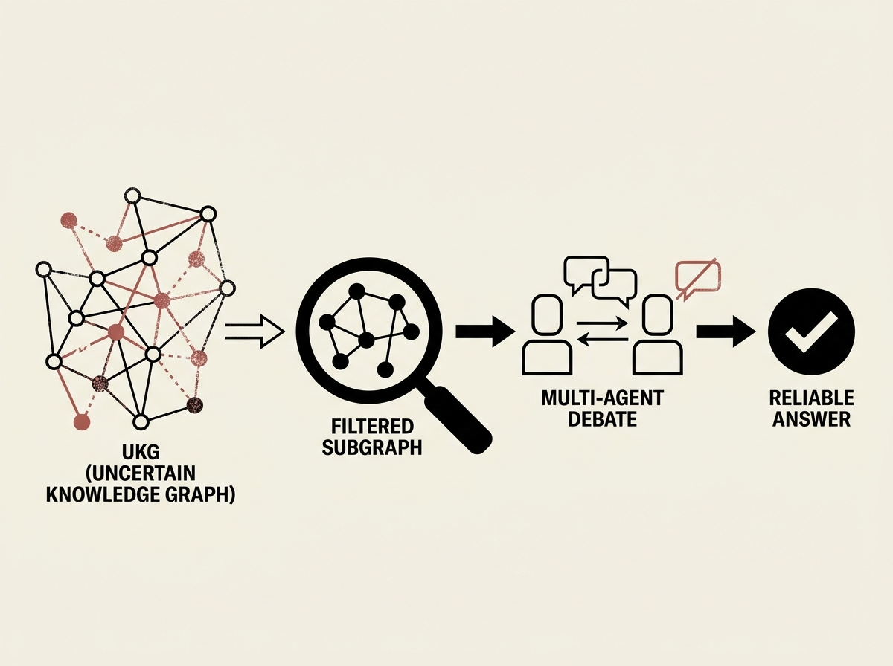

Hallucinations and a lack of specific knowledge plague large language models, especially in question-answering tasks. Traditional knowledge graph (KG) integration often amplifies noise if KGs themselves contain errors.

This paper presents Debate-on-Graph (DoG), a novel framework that uses Uncertain Knowledge Graphs (UKGs) and a multi-agent debate mechanism to provide reliable and adaptive reasoning. DoG first extracts reliable subgraphs from UKGs using a heuristic search, reducing noise.

Then, a Multi-Agent Debate mechanism allows LLMs to collaboratively refine answers, leveraging UKG knowledge while preserving evidence reliability. This approach significantly outperforms existing methods, making it a must-read for anyone building robust RAG or agentic systems.