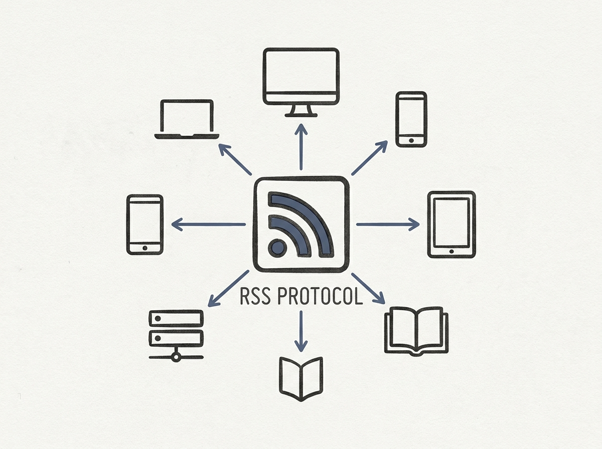

---
authors:
- Dave Winer
- Frank
comments: https://news.ycombinator.com/item?id=48967220
date: '2026-07-19'
hn_id: '48967220'
image: 27-hn-48967220-infographic.png
interest_score: 7
section: systems
source: hn
tags:
- antitrust
- catchup
- crossposting
- hn
- merger
- rss
- trademark-law
title: Paramount-Warner Bros Merger Delayed by Antitrust Lawsuit
url: https://textcaster.app
why_read: Readers will learn about a significant corporate merger facing antitrust
  challenges and a notable trademark dispute. Additionally, it offers practical advice
  on leveraging RSS feeds for easy content crossposting to microblogging platforms.
---

Imagine a social network where the underlying protocol is simply RSS. That is precisely what Textcaster aims to deliver, demonstrating a remarkably clever approach to building distributed communication.

Instead of custom APIs and centralized infrastructure, Textcaster leverages the ubiquitous RSS standard for content sharing and interaction. This design choice simplifies the technical stack significantly, promoting interoperability and decentralization by default. It means your content is already in a format that can be consumed by a vast array of tools.

For senior engineers, this is a fantastic case study in leveraging existing, proven standards to solve modern problems, rather than always building from scratch. It highlights how focusing on simple, robust protocols can lead to elegant and resilient system designs, offering a refreshing perspective on scalability and openness in social platforms.

This is smart system design using an old, reliable friend.