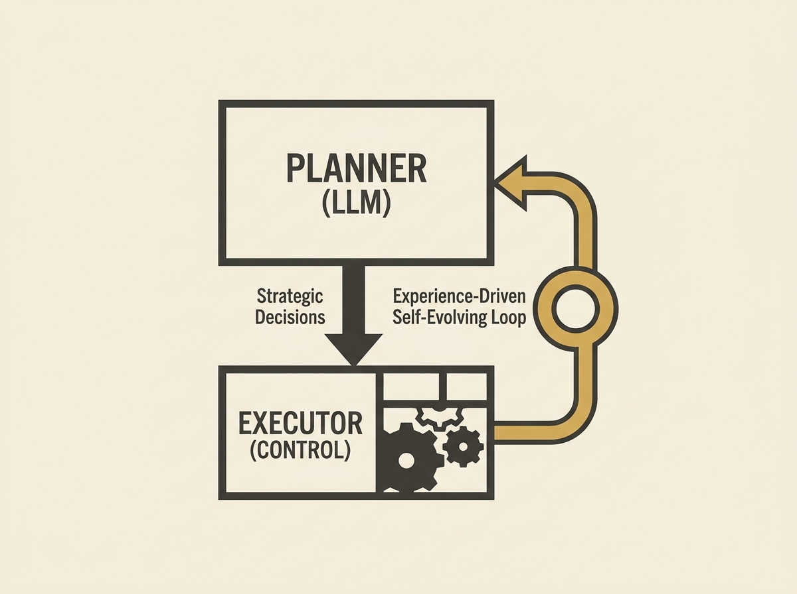

Applying large language models to real-world control systems like auto-bidding is challenging due to issues such as numerical precision, hallucinations, and latency. AIGB-R1 offers a compelling solution through a hierarchical, self-evolving framework.

It decomposes the problem into a high-level LLM-based Planner for strategic decisions and a low-level Executor for fine-grained actions. Crucially, it incorporates an experience-driven self-evolving loop, allowing the system to autonomously explore and optimize strategies over time.

This innovative architecture, along with techniques like Decoupled Group Relative Policy Optimization, provides a blueprint for integrating LLMs into complex, adaptive business systems. It is a robust example of applied AI agent design in practice.