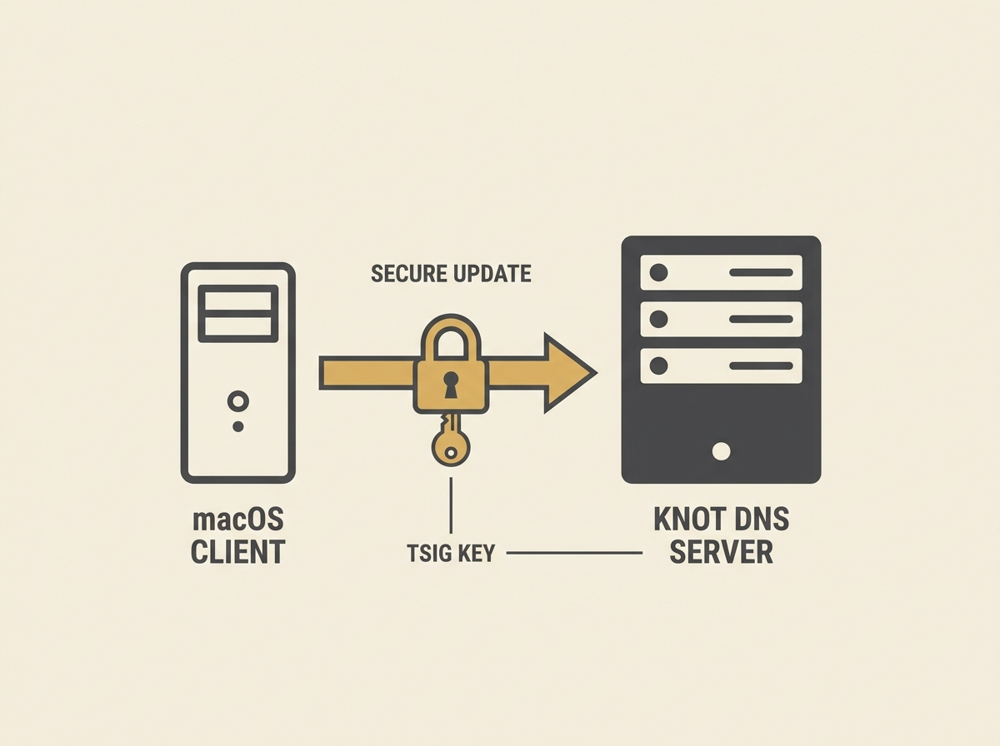

---
authors:
- Brajeshwar
comments: https://news.ycombinator.com/item?id=48970374
date: '2026-07-19'
hn_id: '48970374'
image: 28-hn-48970374-infographic.png
interest_score: 7
section: systems
source: hn
tags:
- catchup
- ddns
- dns-server-setup
- dynamic-dns
- hn
- knot-dns
- macos-integration
- nsupdate
- tsig-key
title: Setting up a self-hosted dynamic DNS with Knot DNS on macOS
url: https://akr.am/blog/posts/self-hosted-dynamic-dns
why_read: This guide provides clear instructions on how to set up a self-hosted dynamic
  DNS service using Knot DNS. Readers will learn to configure the server, generate
  TSIG keys, and integrate it with macOS for automatic IP updates.
---

Managing dynamic IP addresses for self-hosted services can be a pain, but a recent guide offers a robust solution: setting up your own dynamic DNS (DDNS) with Knot DNS. This is a genuinely practical guide for taking control of your network infrastructure.

The setup involves using `nsupdate` for secure record updates, leveraging TSIG keys for authentication, and configuring ACLs within Knot DNS. The guide even covers seamless integration with macOS's built-in DDNS client, showing you how to automatically push updates whenever your machine's IP changes.

This approach moves you away from reliance on third-party DDNS providers, giving you full control over your DNS records and enhancing your home or small-scale lab infrastructure. It is a solid demonstration of effective engineering practices for network services. Learning to deploy and manage such a foundational service is invaluable for any senior engineer looking to deepen their understanding of systems beyond the application layer.

Empower yourself with self-hosted network control.