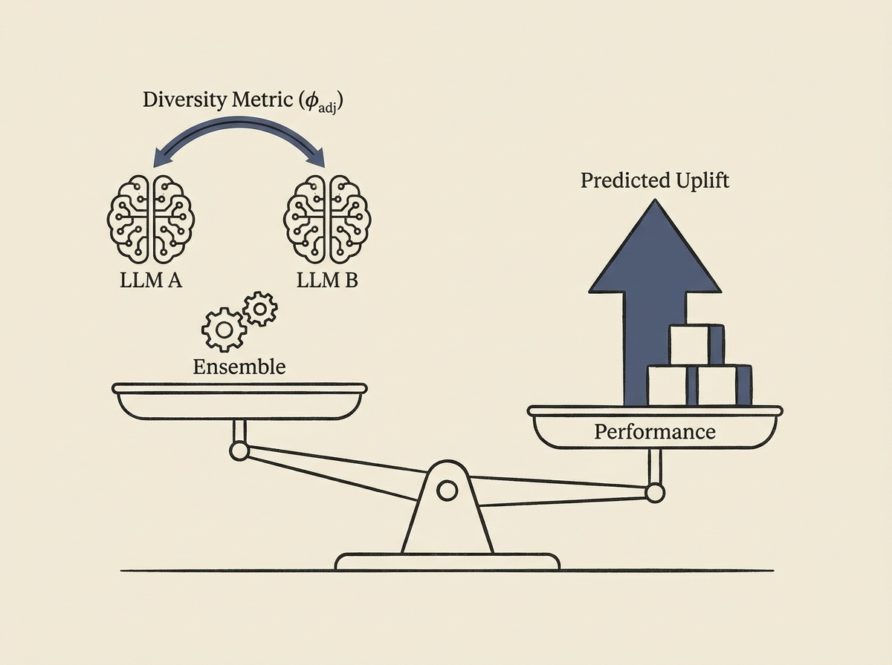

Simply throwing more LLMs into an ensemble does not guarantee better results. The key is quantifying and leveraging "diversity of thought." A new paper provides an experimentally verified formal law for this.

The research derives an exact decomposition of LLM ensemble lift into "rescue" and "damage" masses, leading to a compact heuristic for predicting uplift. It introduces metrics like accuracy-adjusted correctness correlation ($\phi_{\mathrm{adj}}$) that truly predict ensemble performance, unlike raw correlation.

Tested on 767,520 inferences across ten open-weight models, including an agentic cybersecurity benchmark, the heuristic accurately predicted lift with high Spearman's $\rho$. This provides engineers with a powerful, data-driven method to design more effective and predictable LLM ensemble systems, moving beyond trial-and-error.