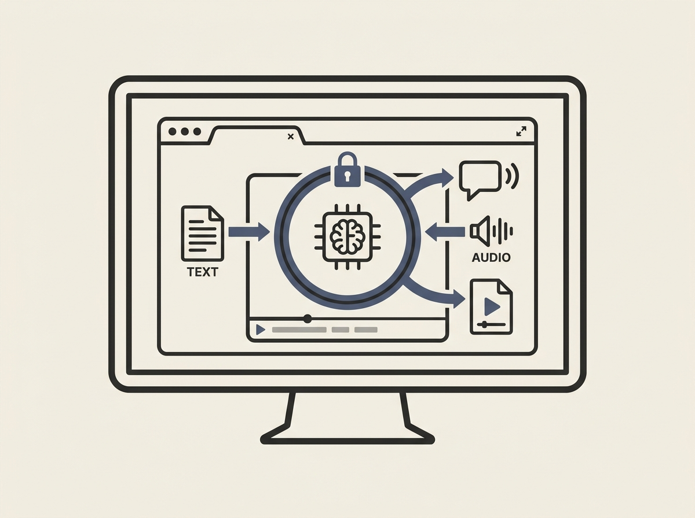

---
authors:
- twainyoung
comments: https://news.ycombinator.com/item?id=48965983
date: '2026-07-19'
hn_id: '48965983'
image: 30-hn-48965983-infographic.png
interest_score: 7
section: ai
source: hn
tags:
- audio-tools
- browser-based
- catchup
- ebook-conversion
- hn
- offline
- private-ai
- speech-to-text
- subtitle-generation
- text-to-speech
title: Private AI Audio Tools Accessible Directly in Your Browser
url: https://offlinetts.com/
why_read: This description showcases a free and private suite of AI audio tools that
  run entirely in your browser. Readers will understand its capabilities for text-to-speech,
  speech-to-text, subtitle generation, and converting documents into audio, all while
  keeping data local.
---

Client-side AI is rapidly evolving, and OfflineTTS showcases a fantastic example: a free, browser-based tool providing text-to-speech (TTS), speech-to-text (STT), and subtitle generation, all running entirely locally. This means zero data leaves your device, ensuring complete privacy.

Leveraging client-side ML models like Whisper directly in the browser for tasks like transcribing audio or generating speech for ebooks offers significant advantages. It cuts down on API costs, reduces latency, and addresses critical privacy concerns that many users have with cloud-based AI services.

This project offers senior engineers a concrete example of how to implement sophisticated applied AI functionalities directly within web applications, highlighting the power of modern browser capabilities for machine learning.