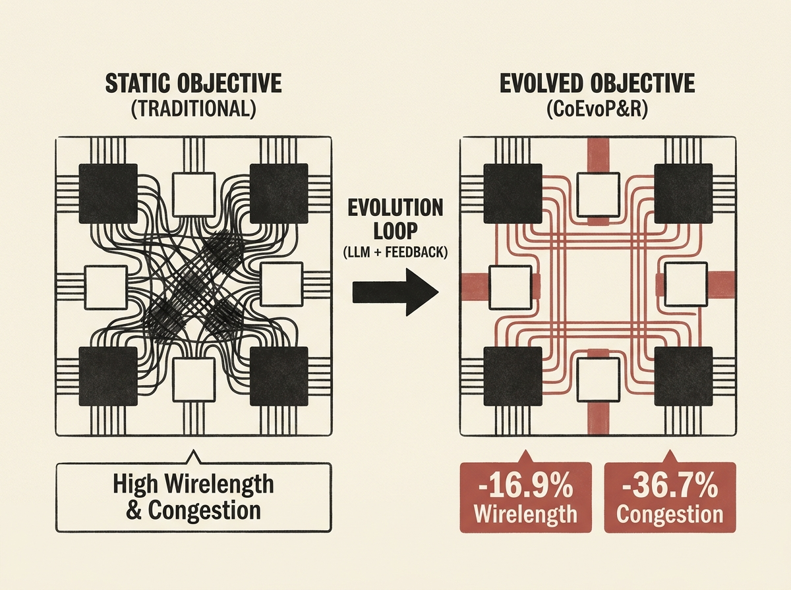

Using large language models to optimize physical chip design is a game-changer.

CoEvoP&R, a new LLM-based framework, automatically evolves analytical placement objectives, moving beyond static human-designed or black-box surrogates. It integrates routing feedback into an iterative evolution loop, allowing the LLM to propose and refine differentiable objectives.

The results are compelling: 16.9% reduction in post-route routed wirelength and 36.7% reduction in congestion across Nangate45 designs. This demonstrates a powerful pattern for how agentic LLMs can tackle complex, multi-objective engineering optimization problems with concrete, measurable impact.