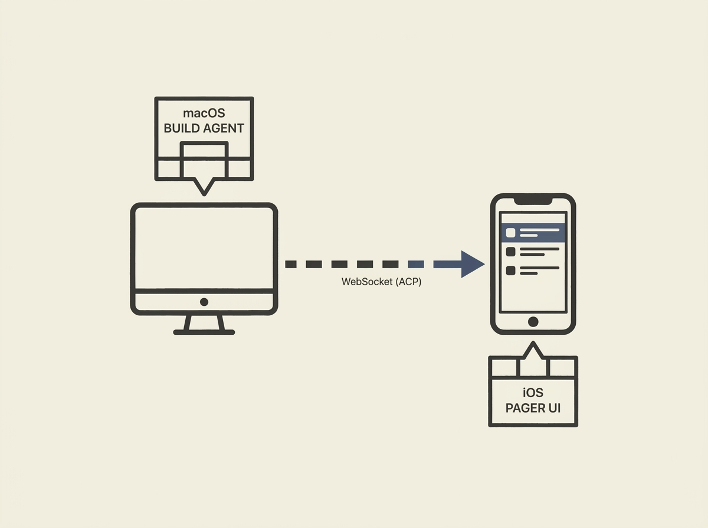

---
authors:
- Pedro Shakour
comments: https://news.ycombinator.com/item?id=48971999
date: '2026-07-19'
hn_id: '48971999'
image: 31-hn-48971999-infographic.png
interest_score: 7
section: ai
source: hn
tags:
- agent-client-protocol
- catchup
- grok-build
- grok-cli
- hn
- ios-client
- pager-ui
- websocket
- xai-api-key
title: iOS client enables phone as remote Grok Build pager UI
url: https://github.com/Pedroshakoor/grok-build-ios
why_read: This text introduces grok-build-ios, an open-source project allowing an
  iOS device to act as a remote pager UI for Grok Build, communicating with a macOS
  agent. Readers will learn how to set up and run this client to monitor their Grok
  builds.
---

Building effective interfaces for AI agents, especially for remote interaction, presents unique system design challenges. Grok-iOS offers a compelling example: an open-source iOS client acting as a remote "pager UI" for Grok Build agents running on a macOS machine.

This project highlights the practicalities of client-server communication in agentic AI. It leverages the Agent Client Protocol (ACP) over WebSocket for a lightweight and responsive connection, allowing engineers to interact with their AI agents from a mobile device.

Understanding such implementations can provide valuable insights into designing distributed user experiences for AI applications, focusing on efficient data transfer and user feedback loops between client and server components.