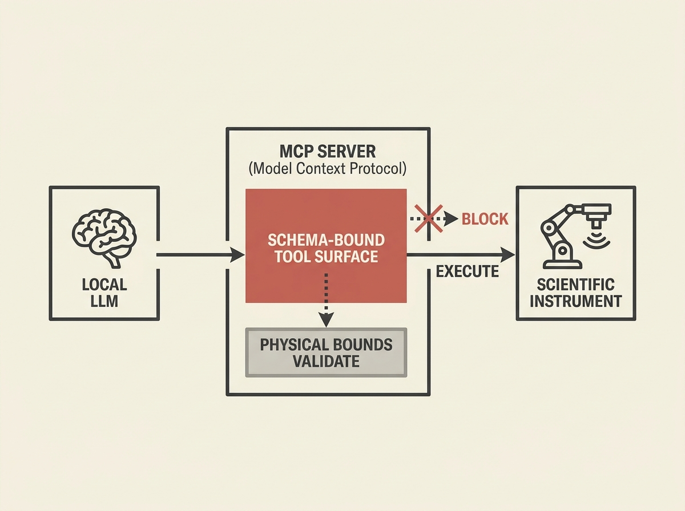

Connecting LLMs to physical scientific instruments is fraught with challenges, from vendor APIs to safety concerns. The Model Context Protocol (MCP) offers a robust solution.

MCP introduces a schema-bound tool surface that validates requests against physical bounds before execution, combined with a vendor-neutral adapter pattern. This modularity cleanly separates LLM reasoning from instrument-side execution, enhancing safety and testability.

By exposing typed tools and skills via a local server, MCP enables closed-loop agentic control using small, open-weight models without cloud dependencies. This is a crucial step for building reliable, autonomous LLM agents in real-world engineering and scientific settings.