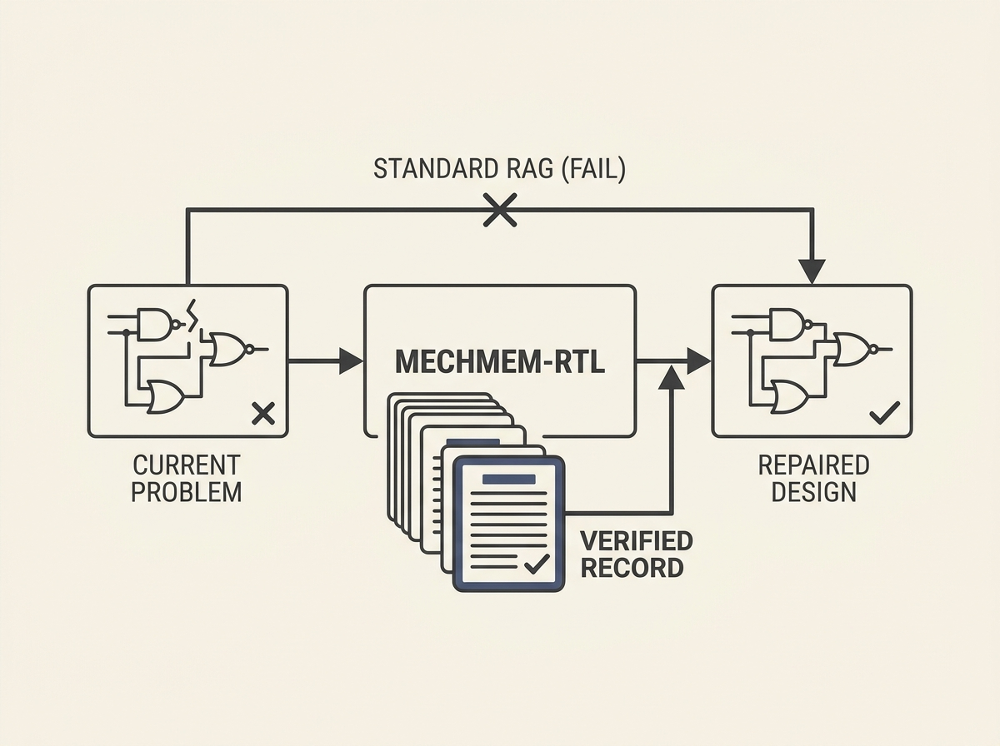

LLMs can repair complex hardware designs, but traditional RAG often fails because natural language struggles to capture cycle-level hardware semantics.

MechMem-RTL introduces a new RAG approach that reuses verifier-confirmed repair records, not just text similarity. It strictly links trigger evidence, diagnosed failure mechanisms, local repair actions, and verification summaries.

This method injects past repair records only when deterministic verifier evidence is compatible with the stored trigger, leading to a significant boost. It successfully resolved 180 out of 288 task-model pairs, dramatically outperforming standard feedback repair (109 pairs) and task-similarity RAG (107 pairs).

This is a smart way to give LLM agents 'experience' in critical domains.