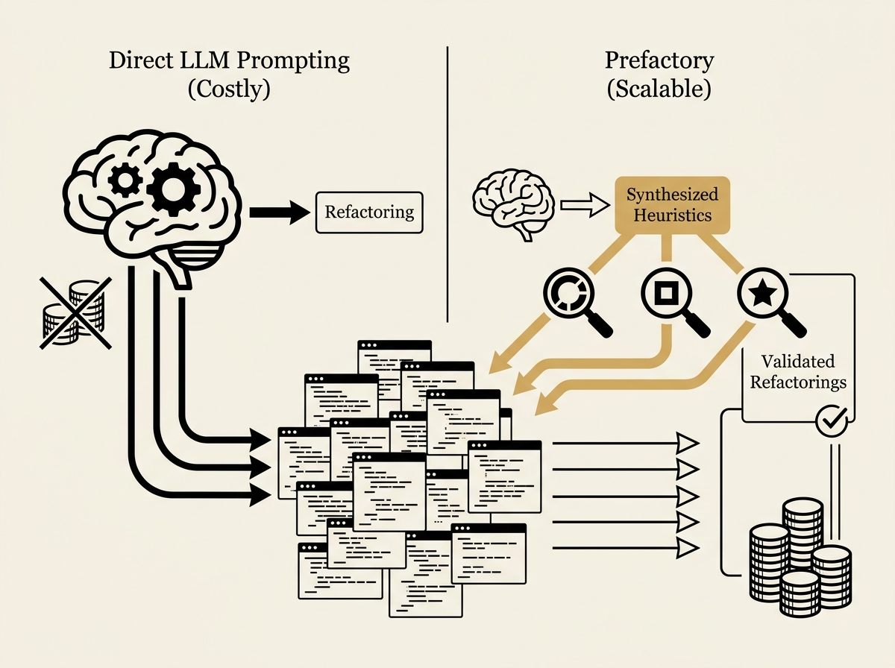

Automating refactoring to replace custom code with library API calls is a huge win for code quality and maintainability, but it is notoriously hard to do at scale because opportunities are often semantically hidden.

Existing tools are limited, and direct LLM prompting is costly and difficult to reproduce. Prefactory introduces a smart solution: it uses an LLM to synthesize *executable search heuristics* instead of constantly prompting the LLM for every refactoring.

Given a project and target library, Prefactory generates lexical and structural detectors, executes them, ranks candidates, and then uses the LLM to generate refactorings which are validated with tests. It detected 56 function-level opportunities and produced 40 test-validated refactorings, significantly outperforming baselines like Codex CLI.

This is a practical, scalable way to leverage LLMs for engineering practices.