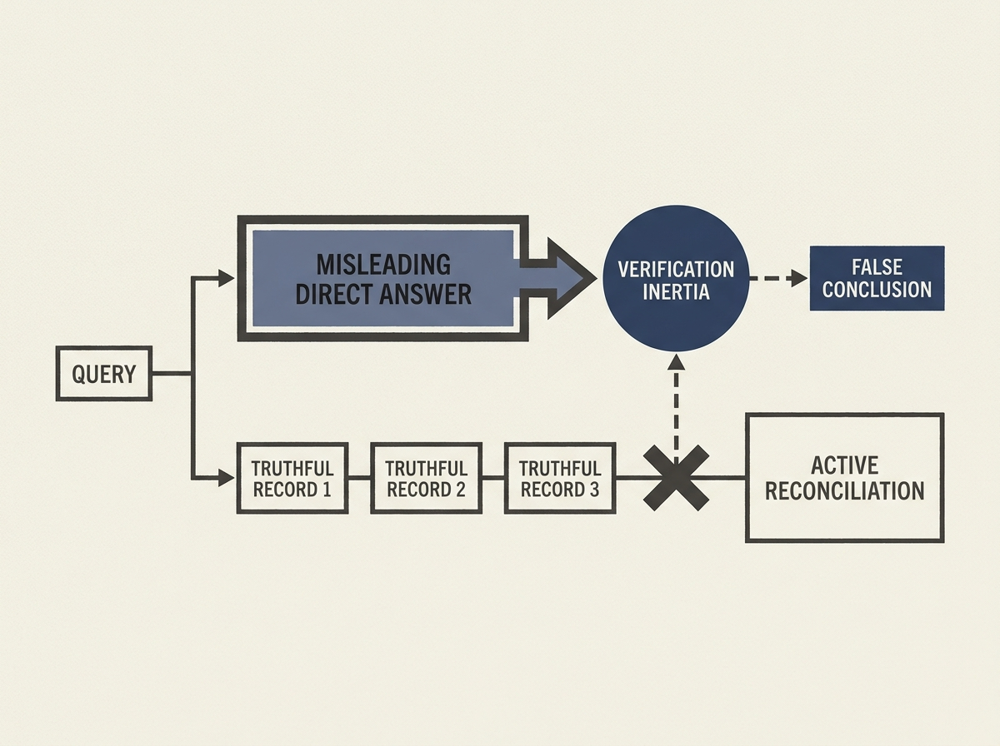

Deep research agents are being deployed to navigate the open web, but what happens when the web contains plausible falsehoods? A new benchmark, DRNOISE, reveals a critical flaw.

Agents, even those with strong performance on clean data, experience massive 66-88 percentage point accuracy drops when a single, ordinary-looking false document is seeded into their search environment. The core problem is "verification inertia": agents often retrieve truthful records but stop before reconciling the full evidence chain, deferring instead to a direct, but conflicting, answer-like document.

This is not about explicit attacks but everyday noise. Generic verification prompts offer some help, but the gap remains large. For reliable open-web deployment, simply retrieving and citing is not enough; agents need active reconciliation of direct claims with record-level evidence. This insight is crucial for building robust, trustworthy AI agents.