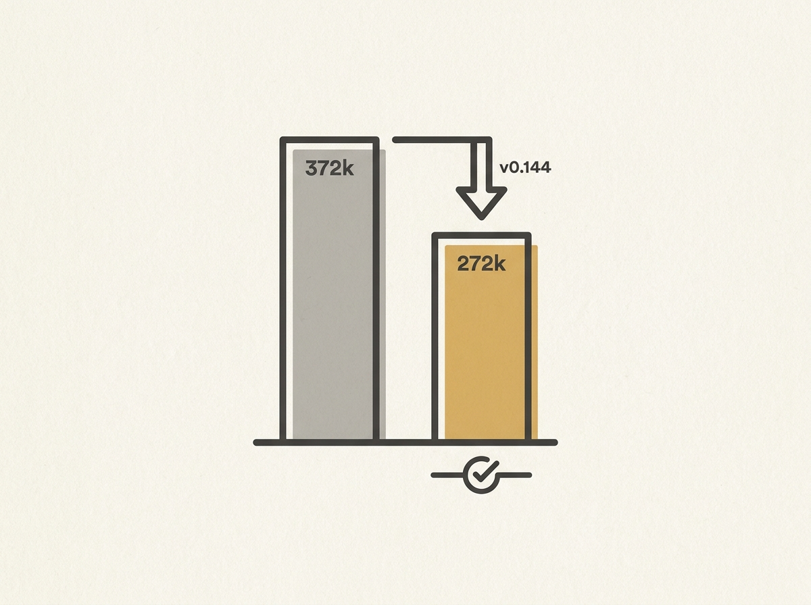

---
authors:
- sayan-oai
comments: https://news.ycombinator.com/item?id=48965850
date: '2026-07-19'
hn_id: '48965850'
image: 41-hn-48965850-infographic.png
interest_score: 7
section: ai
source: hn
tags:
- backport
- catchup
- github-pull-request
- hn
- model-metadata
title: Backport refreshed bundled model metadata to 0.144
url: https://github.com/openai/codex/pull/33972/files
why_read: This document records a specific code change in the openai/codex project.
  Readers will understand how refreshed bundled model metadata was backported to version
  0.144.
---

OpenAI recently made a curious change: they reduced the context window for their Codex model, which powers coding assistants, from 372k to 272k. This move is significant because, in the LLM world, the general trend is often towards ever-larger context windows.

This reduction points to the practical realities and trade-offs in deploying large language models. A smaller context size can lead to lower inference costs, faster response times, and potentially even more stable behavior by reducing the "distraction" of irrelevant information within a massive context. It suggests that for specific tasks like code generation, an optimal context window might not always be the largest one possible.

For engineers working on applied AI and LLM infrastructure, this is a tangible example of optimizing for production environments. It highlights that token efficiency and focused context are critical, not just raw capacity.