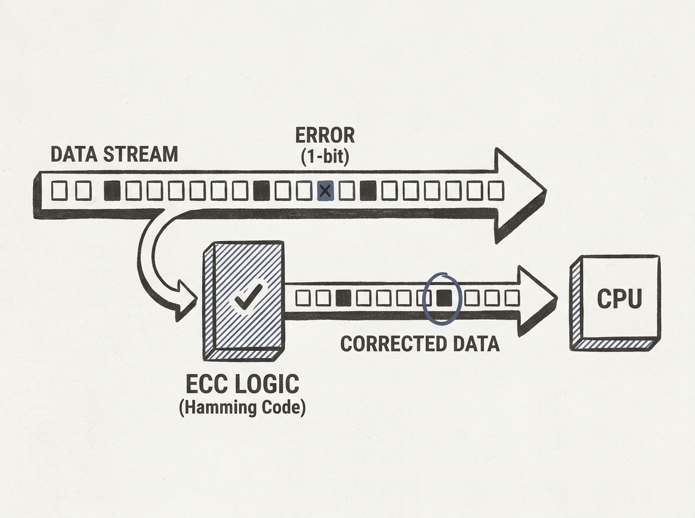

---
authors:
- Russell Coker
comments: https://news.ycombinator.com/item?id=48969530
date: '2026-07-19'
hn_id: '48969530'
image: 42-hn-48969530-infographic.png
interest_score: 7
section: systems
source: hn
tags:
- catchup
- ddr5
- ecc
- hamming-code
- hn
- memory-modules
- memory-pricing
- rdimm
- udimm
title: ECC and DDR5 memory types practical implications
url: https://etbe.coker.com.au/2026/07/19/ecc-ddr5/
why_read: This post explains the technical distinctions between ECC and non-ECC, and
  RDIMM and UDIMM memory modules. It provides practical insights into their common
  uses and discusses the economic factors influencing the price of ECC RDIMMs in the
  second-hand market.
---

ECC RAM is more than just a buzzword; it is a critical component for system reliability, especially in servers. This post details how Hamming codes allow memory to correct single-bit errors and detect double-bit errors before data ever reaches the CPU.

You learn the nuances between Registered DIMMs (RDIMMs) and Unbuffered DIMMs (UDIMMs), and why RDIMMs are almost always coupled with ECC, offering higher capacity and stability for server environments. This distinction is crucial for understanding server-grade hardware.

It helps you appreciate the engineering trade-offs made for data integrity at the hardware level, which is foundational knowledge for designing robust software systems.