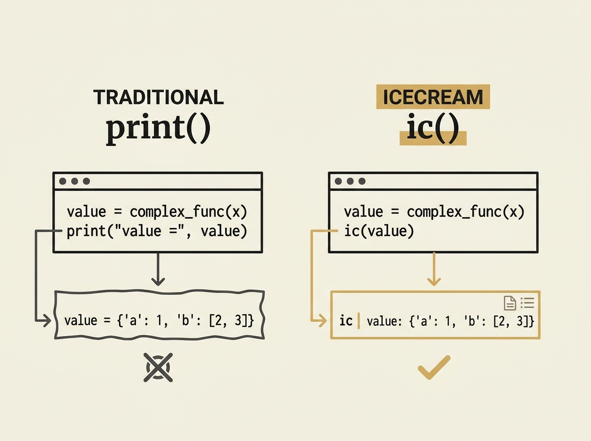

---
authors:
- Jakeroid
- Ivan Karabadzhak
comments: https://news.ycombinator.com/item?id=48964243
date: '2026-07-19'
hn_id: '48964243'
image: 43-hn-48964243-infographic.png
interest_score: 7
section: engineering
source: hn
tags:
- catchup
- developer-tool
- hn
- icecream-library
- print-debugging
- python
- variable-inspection
title: IceCream simplifies and enhances traditional print debugging in Python
url: https://github.com/gruns/icecream
why_read: Read this to discover the IceCream library, a powerful alternative to traditional
  print() statements for debugging Python code. You will learn how it improves variable
  inspection, output formatting, and provides program context.
---

Are you still debugging Python with plain old print() statements? It is time for an upgrade. The icecream library, or ic() for short, can transform your debugging workflow.

Instead of print("foo('123')", foo('123')), you can just type ic(foo('123')). It automatically prints both the expression and its value, along with the filename, line number, and parent function. This drastically reduces verbosity and mental overhead.

icecream also pretty-prints data structures and offers syntax highlighting. This small change in tooling can lead to significant gains in developer productivity, making your debugging sessions much more efficient and less error-prone. Stop manually formatting your debug output.